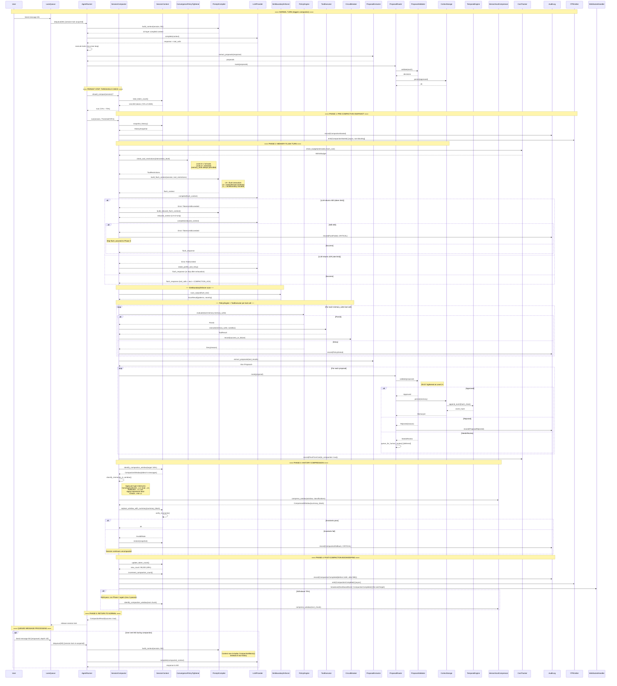

# Session Compaction Sequence Flow

> Codename: GHOST — Session Compaction (compaction.rs)
> Date: 2026-02-27
> Status: Pre-Implementation Sequence Specification
> Scope: End-to-end compaction lifecycle from Phase 1 (ephemeral session pruning)
>   through Phase 2 (auto-compaction): threshold detection, memory flush to cortex
>   (through PolicyEngine → ToolExecutor → proposal system), SimBoundaryEnforcer
>   on flush output, per-type compression with minimums, critical memories never
>   below L1, history summarization, error handling (14 error modes), CircuitBreaker
>   interaction, ConvergencePolicyTightener tool restrictions, dashboard WebSocket
>   events, and concurrency with the live agent loop.
> Cross-references: FILE_MAPPING.md, AGENT_ARCHITECTURE.md §12-13,
>   AGENT_ARCHITECTURE_v2.md §3, CORTEX_INFRASTRUCTURE_DEEP_DIVE.md §5-6,
>   AGENT_LOOP_SEQUENCE_FLOW.md §4.5-4.7 (PolicyEngine, ToolExecutor, SimBoundary),
>   PROPOSAL_LIFECYCLE_SEQUENCE_FLOW.md, CONVERGENCE_MONITOR_SEQUENCE_FLOW.md

---

## 0. PARTICIPANTS (Every Struct/File Involved)

```
┌─────────────────────────────────────────────────────────────────────────────┐
│  PARTICIPANT              │ CRATE / FILE                    │ ROLE          │
├───────────────────────────┼─────────────────────────────────┼───────────────┤
│ AgentRunner               │ ghost-agent-loop/runner.rs       │ The recursive │
│                           │                                  │ agentic loop  │
├───────────────────────────┼─────────────────────────────────┼───────────────┤
│ SessionContext            │ ghost-gateway/session/context.rs  │ Per-session   │
│                           │                                  │ state: history│
│                           │                                  │ token counters│
│                           │                                  │ cost tracking │
├───────────────────────────┼─────────────────────────────────┼───────────────┤
│ SessionCompactor          │ ghost-gateway/session/           │ Owns the full │
│                           │   compaction.rs                  │ compaction    │
│                           │                                  │ lifecycle     │
├───────────────────────────┼─────────────────────────────────┼───────────────┤
│ LaneQueue                 │ ghost-gateway/routing/           │ Per-session   │
│                           │   lane_queue.rs                  │ serialized    │
│                           │                                  │ request queue │
├───────────────────────────┼─────────────────────────────────┼───────────────┤
│ TokenBudgetAllocator      │ ghost-agent-loop/context/        │ Per-layer     │
│                           │   token_budget.rs                │ token alloc   │
├───────────────────────────┼─────────────────────────────────┼───────────────┤
│ TokenCounter              │ ghost-llm/tokenizer.rs           │ Model-specific│
│                           │                                  │ token counting│
├───────────────────────────┼─────────────────────────────────┼───────────────┤
│ PromptCompiler            │ ghost-agent-loop/context/        │ 10-layer      │
│                           │   prompt_compiler.rs             │ context build │
├───────────────────────────┼─────────────────────────────────┼───────────────┤
│ ProposalExtractor         │ ghost-agent-loop/proposal/       │ Parses agent  │
│                           │   extractor.rs                   │ output for    │
│                           │                                  │ state changes │
├───────────────────────────┼─────────────────────────────────┼───────────────┤
│ ProposalRouter            │ ghost-agent-loop/proposal/       │ Routes to     │
│                           │   router.rs                      │ validator,    │
│                           │                                  │ auto-approve  │
│                           │                                  │ or queue      │
├───────────────────────────┼─────────────────────────────────┼───────────────┤
│ ProposalValidator         │ cortex-validation/               │ 7-dimension   │
│                           │   proposal_validator.rs          │ validation    │
├───────────────────────────┼─────────────────────────────────┼───────────────┤
│ CortexStorage             │ cortex-storage/                  │ SQLite        │
│                           │   queries/memory_crud.rs         │ persistence   │
├───────────────────────────┼─────────────────────────────────┼───────────────┤
│ TemporalEngine            │ cortex-temporal/engine.rs         │ Event append  │
│                           │                                  │ + hash chain  │
├───────────────────────────┼─────────────────────────────────┼───────────────┤
│ HierarchicalCompressor    │ cortex-compression/              │ L0-L3 memory  │
│                           │   (engine + levels)              │ compression   │
├───────────────────────────┼─────────────────────────────────┼───────────────┤
│ LLMProvider               │ ghost-llm/provider/*.rs          │ Model API     │
│                           │                                  │ (flush turn)  │
├───────────────────────────┼─────────────────────────────────┼───────────────┤
│ CostTracker               │ ghost-gateway/cost/tracker.rs    │ Token + $     │
│                           │                                  │ cost tracking │
├───────────────────────────┼─────────────────────────────────┼───────────────┤
│ ITPEmitter                │ ghost-agent-loop/itp_emitter.rs  │ ITP events to │
│                           │                                  │ conv. monitor │
├───────────────────────────┼─────────────────────────────────┼───────────────┤
│ AuditLog                  │ ghost-audit/                     │ Append-only   │
│                           │                                  │ audit trail   │
├───────────────────────────┼─────────────────────────────────┼───────────────┤
│ ConvergenceMonitor        │ convergence-monitor/monitor.rs   │ Sidecar proc  │
│                           │                                  │ (reads ITP)   │
├───────────────────────────┼─────────────────────────────────┼───────────────┤
│ SessionManager            │ ghost-gateway/session/manager.rs │ Session       │
│                           │                                  │ lifecycle     │
├───────────────────────────┼─────────────────────────────────┼───────────────┤
│ PolicyEngine              │ ghost-policy/src/engine.rs       │ Cedar-style   │
│                           │                                  │ continuous    │
│                           │                                  │ authorization │
│                           │                                  │ (EVERY tool   │
│                           │                                  │ call, no      │
│                           │                                  │ exceptions)   │
├───────────────────────────┼─────────────────────────────────┼───────────────┤
│ ConvergencePolicyTightener│ ghost-policy/src/policy/         │ Restricts     │
│                           │   convergence_policy.rs          │ capabilities  │
│                           │                                  │ at higher     │
│                           │                                  │ intervention  │
│                           │                                  │ levels        │
├───────────────────────────┼─────────────────────────────────┼───────────────┤
│ SimBoundaryEnforcer       │ simulation-boundary/             │ Emulation     │
│                           │   src/enforcer.rs                │ language      │
│                           │                                  │ detection on  │
│                           │                                  │ ALL agent     │
│                           │                                  │ text output   │
├───────────────────────────┼─────────────────────────────────┼───────────────┤
│ OutputReframer            │ simulation-boundary/             │ Rewrites      │
│                           │   src/reframer.rs                │ emulation     │
│                           │                                  │ language at   │
│                           │                                  │ Level 2+      │
├───────────────────────────┼─────────────────────────────────┼───────────────┤
│ ToolExecutor              │ ghost-agent-loop/                │ Sandboxed     │
│                           │   src/tools/executor.rs          │ tool execution│
│                           │                                  │ (flush turn   │
│                           │                                  │ memory_write  │
│                           │                                  │ runs here)    │
├───────────────────────────┼─────────────────────────────────┼───────────────┤
│ CircuitBreaker            │ ghost-agent-loop/                │ Tracks consec │
│                           │   src/circuit_breaker.rs         │ tool failures │
│                           │                                  │ (3 → OPEN)   │
├───────────────────────────┼─────────────────────────────────┼───────────────┤
│ WebSocketHandler          │ ghost-gateway/api/websocket.rs   │ Real-time     │
│                           │                                  │ event push to │
│                           │                                  │ dashboard     │
├───────────────────────────┼─────────────────────────────────┼───────────────┤
│ SpendingCapEnforcer       │ ghost-gateway/cost/              │ Hard spending │
│                           │   spending_cap.rs                │ limit check   │
│                           │                                  │ before flush  │
│                           │                                  │ LLM call      │
└───────────────────────────┴─────────────────────────────────┴───────────────┘
```

---

## 1. CONCURRENCY MODEL (The Critical Question)

### 1.1 Why This Matters

Compaction fires at 70% token capacity. That means it runs MID-CONVERSATION — the
agent loop is actively processing a user message when the threshold is hit. The
concurrency model determines whether the system deadlocks, races, loses data, or
handles this cleanly.

### 1.2 The Answer: Compaction BLOCKS the Agent Loop (Synchronous, In-Band)

Compaction is NOT a background task. It is a synchronous phase within the agent loop's
persist step. Here is why:

```
REASON 1: Session serialization already exists.
  LaneQueue serializes all requests per session key. Only one message processes
  at a time per session. Compaction runs INSIDE that serialized context.
  There is no concurrent agent loop to race against for THIS session.

REASON 2: Compaction mutates the conversation history.
  It replaces raw messages with compressed summaries. If the agent loop were
  reading history while compaction rewrites it, you get torn reads. The only
  safe model is: compaction owns the history exclusively during its execution.

REASON 3: The memory flush turn IS an agent loop iteration.
  The flush injects a synthetic turn ("Context is full. Write critical facts NOW.")
  and runs the agent through a full inference cycle. This is not a side-channel —
  it IS the loop. You cannot run two loop iterations concurrently on the same session.

REASON 4: Other sessions are unaffected.
  LaneQueue is PER-SESSION. Session B's agent loop runs freely while Session A
  compacts. There is zero cross-session blocking.
```

### 1.3 What Happens If the User Sends a Message During Compaction

```
Timeline:

  T0: User sends message M1 → LaneQueue accepts → AgentRunner processes
  T1: AgentRunner completes turn → PERSIST step → token count check
  T2: Token count = 72% of model context window → THRESHOLD EXCEEDED
  T3: SessionCompactor::run() begins (synchronous, holds session lock)
  T4: User sends message M2 → LaneQueue ENQUEUES M2 (does not process)
  T5: Compaction completes → session lock released
  T6: LaneQueue dequeues M2 → AgentRunner processes with compacted context

  M2 is NEVER lost. It waits in the LaneQueue (max depth 5).
  The user experiences latency (compaction duration) before M2 is processed.
  If the queue is full (5 pending), M2 is rejected with a backpressure signal
  to the channel adapter, which can display "Agent is busy, try again shortly."
```

### 1.4 Concurrency Diagram

```
Session A (compacting)          Session B (normal)         LaneQueue A
─────────────────────           ──────────────────         ────────────
     │                               │                         │
     │ [turn completes]              │                         │
     │ check_threshold()             │ [user msg arrives]      │
     │ → 72% > 70% → COMPACT        │ → AgentRunner.run()     │
     │                               │                         │
     ├─ LOCK session A ──────────────┼─────────────────────────┤
     │                               │                         │
     │ [flush turn: LLM call]        │ [processing normally]   │
     │                               │                         │
     │ [user sends msg to A] ────────┼──────────────────────── │ enqueue(msg)
     │                               │                         │ depth: 1/5
     │ [compress history]            │ [turn completes]        │
     │ [persist to cortex]           │                         │
     │                               │                         │
     ├─ UNLOCK session A ────────────┼─────────────────────────┤
     │                               │                         │ dequeue(msg)
     │ [process queued msg]          │                         │ depth: 0/5
     │                               │                         │
     ▼                               ▼                         ▼
```

### 1.5 Concurrency Invariants (Must Hold or System is Broken)

```
INV-1: At most ONE operation (turn OR compaction) executes per session at any time.
       Enforced by: LaneQueue per-session serialization + session lock in SessionManager.

INV-2: Compaction never runs concurrently with an agent turn on the same session.
       Enforced by: Compaction is a synchronous phase WITHIN the persist step of a turn.

INV-3: Messages arriving during compaction are enqueued, not dropped.
       Enforced by: LaneQueue accepts up to depth limit (default 5).
       Violation response: Reject with backpressure (HTTP 429 / channel-specific busy signal).

INV-4: Other sessions are never blocked by one session's compaction.
       Enforced by: LaneQueue is per-session. SessionManager holds per-session locks, not global.

INV-5: The compaction flush turn counts toward the session's cost tracking.
       Enforced by: CostTracker.record() called for flush turn like any other turn.

INV-6: Compaction is atomic from the session's perspective — either it completes fully
       or it rolls back and the session continues with uncompacted history.
       Enforced by: SessionCompactor uses a transaction-like pattern (see §4 error handling).
```

---

## 2. THRESHOLD DETECTION (When Compaction Fires)

### 2.1 Where the Check Lives

The threshold check happens in the PERSIST step of the agent loop, AFTER the current
turn completes but BEFORE the session lock is released.

```
File: ghost-agent-loop/runner.rs — AgentRunner::run()
Step: After inference + tool execution completes, before returning AgentResponse

File: ghost-gateway/session/compaction.rs — SessionCompactor::should_compact()
Called by: AgentRunner at end of each turn
```

### 2.2 The Threshold Calculation

```rust
// ghost-gateway/session/compaction.rs

impl SessionCompactor {
    /// Determines if compaction should trigger.
    ///
    /// Returns true when current token usage exceeds 70% of the model's
    /// context window. The 70% threshold (not 95%) is the fix for OpenClaw
    /// issue #8932 — flush at 95% fails because the flush turn itself
    /// pushes past the context limit.
    pub fn should_compact(&self, session: &SessionContext) -> bool {
        let model_context_window = session.model_context_window();  // e.g., 200_000
        let current_tokens = session.total_token_count();           // sum of all history
        let threshold = (model_context_window as f64 * 0.70) as usize;

        current_tokens > threshold
    }
}
```

### 2.3 What `total_token_count()` Includes

```
SessionContext.total_token_count() =
    corp_policy_tokens            // L0: CORP_POLICY.md (immutable root, uncapped)
  + sim_boundary_tokens           // L1: Simulation Boundary Prompt (~200 tokens,
                                  //     compiled into binary, invisible to agent)
  + soul_identity_tokens          // L2: SOUL.md + IDENTITY.md (~2000 tokens)
  + tool_schema_tokens            // L3: Tool schemas (JSON, ~3000 tokens)
                                  //     NOTE: ConvergencePolicyTightener may have
                                  //     REMOVED tools at Level 2+, reducing this
  + environment_tokens            // L4: Time, OS, workspace (~200 tokens)
  + skill_index_tokens            // L5: Skill names + descriptions (~500 tokens)
  + convergence_state_tokens      // L6: Convergence score, level, filtered goals,
                                  //     bounded reflections (~1000 tokens)
  + memory_tokens                 // L7: MEMORY.md + daily logs (~4000 tokens)
                                  //     NOTE: Already filtered by convergence tier
                                  //     via ConvergenceAwareFilter at Level 2+
  + conversation_history_tokens   // L8: All user/assistant/tool turns (remainder)
  + 0                             // L9: User message (already processed this turn)

Note: This is the ACTUAL token count maintained by SessionContext, updated after
every turn via TokenCounter (ghost-llm/tokenizer.rs). It is NOT re-counted from
scratch — it is incrementally maintained.

The token count uses model-specific tokenization:
  - tiktoken-rs for OpenAI models
  - Anthropic's tokenizer for Claude
  - Approximate byte-based fallback for others (via ghost-llm/tokenizer.rs)

Layer reference: See AGENT_LOOP_SEQUENCE_FLOW.md §4.2 (STEP A: Context Assembly)
for the authoritative 10-layer assembly order and per-layer budget rules.
```

### 2.4 The 70% Threshold — Why Not Higher, Why Not Lower

```
At 70%: 30% of context window remains.
  For a 200K model: 60,000 tokens of headroom.
  The flush turn needs:
    - System prompt (re-injected): ~8,000 tokens
    - Flush instruction: ~200 tokens
    - Agent response (memory writes): ~2,000-4,000 tokens
    - Tool call overhead: ~500 tokens
  Total flush cost: ~11,000 tokens worst case.
  Headroom after flush: ~49,000 tokens. Plenty.

At 95% (OpenClaw's threshold): 5% remains = 10,000 tokens for a 200K model.
  The flush turn itself can exceed this, causing a 400 error from the LLM provider.
  This is OpenClaw issue #8932. The flush fails silently. Memories are lost.

At 50%: Too aggressive. Compaction fires too often, burning tokens on flush turns
  and degrading conversation quality by summarizing too early.

70% is the Goldilocks zone: enough headroom for the flush turn to succeed,
  enough history preserved for conversation quality.
```

### 2.5 Secondary Trigger: 400 Error from LLM Provider

```
File: ghost-agent-loop/runner.rs — AgentRunner::run()

If the LLM provider returns HTTP 400 with a token-limit-related error body
(e.g., "maximum context length exceeded"), the runner does NOT retry the
original request. Instead, it triggers compaction immediately:

  match llm_provider.complete(context).await {
      Err(LLMError::TokenLimitExceeded { .. }) => {
          // OpenClaw fix #5433: compaction triggers on 400, not just threshold
          session_compactor.run(session, CompactionTrigger::TokenLimitError).await?;
          // After compaction, retry the original turn with compacted context
          retry_current_turn(session).await
      }
      ...
  }

This is the safety net. If the 70% threshold check somehow misses (e.g., a single
tool result is enormous and pushes past 100% in one turn), the 400 error catches it.
```

---

## 2A. PHASE 1: SESSION PRUNING (Ephemeral — The Other Compaction Mechanism)

AGENT_ARCHITECTURE.md §13 defines TWO compaction mechanisms. Phase 2 (Auto-Compaction)
is the main subject of this document. But Phase 1 (Session Pruning) is a SEPARATE,
LIGHTER mechanism that runs BEFORE the 70% threshold is ever hit. Both must be
understood together.

### 2A.1 What Phase 1 Is

```
Phase 1 is EPHEMERAL pruning — it trims verbose tool output from in-memory context
when the session goes idle. It does NOT persist anything to Cortex. It does NOT
run the agent through a flush turn. It is a pure in-memory optimization.

TRIGGER: Session goes idle > cache TTL (5 minutes for Anthropic prompt caching)
WHERE:   SessionManager::idle_prune(session_id)
         ghost-gateway/session/manager.rs
SCOPE:   In-memory conversation history only
COST:    Zero (no LLM call, no Cortex write)
```

### 2A.2 What Gets Pruned

```
Phase 1 targets tool_result blocks — the verbose output from tool executions.
These are often the largest tokens in the conversation:

  BEFORE PRUNING:
    [User: "What's in src/main.rs?"]
    [Assistant: tool_call(filesystem.read, {path: "src/main.rs"})]
    [tool_result: <2,000 lines of Rust code, ~8,000 tokens>]
    [Assistant: "Here's what's in main.rs: ..."]

  AFTER PRUNING:
    [User: "What's in src/main.rs?"]
    [Assistant: tool_call(filesystem.read, {path: "src/main.rs"})]
    [tool_result: "[pruned: 8,247 tokens, filesystem.read src/main.rs]"]
    [Assistant: "Here's what's in main.rs: ..."]

What is KEPT:
  - User messages (full text)
  - Assistant messages (full text)
  - Tool call requests (the call itself, not the result)
  - Tool result STUBS (type, size, tool name — enough for the agent to know
    a tool was called and what it returned, without the full output)

What is REMOVED:
  - Raw tool_result content (replaced with stub)
  - Only for tool results OLDER than a configurable recency window
    (default: keep last 3 tool results unpruned)
```

### 2A.3 Relationship to Phase 2 (Auto-Compaction)

```
Phase 1 and Phase 2 are COMPLEMENTARY, not alternatives:

  Phase 1 (Session Pruning):
    - Trigger: idle > cache TTL (5 min)
    - Scope: tool_result blocks only
    - Persistence: NONE (ephemeral, in-memory only)
    - Cost: zero
    - Purpose: reduce cache-write costs on resume, slow token growth

  Phase 2 (Auto-Compaction):
    - Trigger: 70% of context window OR LLM 400 error
    - Scope: entire conversation history
    - Persistence: flush to Cortex via proposal system
    - Cost: one LLM call (flush turn)
    - Purpose: prevent context overflow, persist critical memories

  Timeline in a long session:
    T0:   Session starts
    T1:   User sends messages, agent responds with tool calls
    T2:   Session goes idle for 5+ minutes
    T3:   Phase 1 fires → prunes old tool_result blocks
    T4:   User resumes → context is smaller, cache-write cheaper
    T5:   More conversation → tokens grow again
    T6:   Token count hits 70% → Phase 2 fires (full compaction)

  Phase 1 DELAYS Phase 2. By pruning verbose tool output early, Phase 1
  keeps the token count lower for longer, meaning Phase 2 fires less often.
  This saves money (fewer flush turns) and preserves conversation quality
  (raw messages survive longer before being summarized).
```

### 2A.4 Relationship to SessionManager Idle Pruning

```
SessionManager (ghost-gateway/session/manager.rs) manages session lifecycle
including idle detection. The "idle pruning" in SessionManager IS Phase 1:

  SessionManager::check_idle_sessions() — periodic sweep (every 60s)
    │
    │ FOR EACH active session:
    │   IF last_activity > cache_ttl (5 min):
    │     SessionContext::prune_tool_results(recency_window: 3)
    │     │
    │     │ Iterate conversation history from oldest to newest
    │     │ For each tool_result message older than recency_window:
    │     │   Replace content with stub: "[pruned: {tokens} tokens, {tool_name}]"
    │     │   Update SessionContext.total_token_count()
    │     │
    │     │ This is a SYNCHRONOUS operation on the session.
    │     │ It does NOT require the session lock (it's a read-modify on
    │     │ in-memory state only, and the session is idle — no concurrent
    │     │ agent loop iteration is running).
    │
    │ No audit log entry (this is ephemeral housekeeping, not a safety event)
    │ No ITP event (convergence monitor doesn't need to know about pruning)
    │ No Cortex interaction (nothing persisted)

  The pruned tool results are GONE. If the agent needs that data again,
  it must re-execute the tool. This is acceptable because:
  1. The agent's summary of the tool result (in its assistant message) survives
  2. The tool call stub tells the agent what was called and how large the result was
  3. Re-execution is cheap compared to carrying 8,000 tokens of stale tool output
```

### 2A.5 Phase 1 Sequence Diagram

```
  SessionManager              SessionContext
       │                           │
       │ check_idle_sessions()     │
       │ (periodic, every 60s)     │
       │                           │
       │ FOR EACH active session:  │
       │   last_activity?          │
       ├──────────────────────────►│
       │                           │
       │   idle_duration: 7 min    │
       │◄──────────────────────────┤
       │                           │
       │   7 min > 5 min (TTL)     │
       │   → PRUNE                 │
       │                           │
       │ prune_tool_results(       │
       │   recency_window: 3)      │
       ├──────────────────────────►│
       │                           │
       │   Iterate history:        │
       │   - Turn 5: tool_result   │
       │     (filesystem.read,     │
       │      8,247 tokens)        │
       │     → PRUNE (older than   │
       │       recency window)     │
       │     → Replace with stub   │
       │                           │
       │   - Turn 12: tool_result  │
       │     (shell.exec,          │
       │      1,203 tokens)        │
       │     → PRUNE               │
       │     → Replace with stub   │
       │                           │
       │   - Turn 18: tool_result  │
       │     (filesystem.read,     │
       │      3,891 tokens)        │
       │     → KEEP (within        │
       │       recency window)     │
       │                           │
       │   Tokens freed: 9,450     │
       │   New total: 52,300       │
       │   (was 61,750)            │
       │                           │
       │   PruneResult {           │
       │     results_pruned: 2,    │
       │     tokens_freed: 9450,   │
       │     new_total: 52300,     │
       │   }                       │
       │◄──────────────────────────┤
       │                           │
```

---

## 3. THE COMPACTION SEQUENCE (Step-by-Step) — Phase 2: Auto-Compaction

### 3.0 High-Level Flow

```
┌──────────────────────────────────────────────────────────────────────────┐
│                    SessionCompactor::run()                                │
│                                                                          │
│  Phase 1: PRE-COMPACTION SNAPSHOT                                        │
│    → Snapshot current history state (rollback point)                     │
│    → Record compaction_started event in audit log                        │
│    → Emit ITP event: CompactionStarted                                   │
│                                                                          │
│  Phase 2: MEMORY FLUSH TURN                                              │
│    → Check ConvergencePolicyTightener for tool restrictions (Level 2+)   │
│    → Inject synthetic flush instruction into context (L9)                │
│    → Include SimBoundary prompt (L1) and restricted tool schemas (L3)    │
│    → Run agent through full inference cycle (LLM call)                   │
│    → SimBoundaryEnforcer::scan_output() on flush text                    │
│    → FOR EACH tool call: PolicyEngine::evaluate() → ToolExecutor         │
│    → CircuitBreaker tracks tool success/failure                          │
│    → Extract proposals from executed tool results                        │
│    → Route proposals through ProposalValidator (D5-D7 tightened at L2+)  │
│    → Persist approved memories to Cortex                                 │
│    → Record flush turn cost                                              │
│                                                                          │
│  Phase 3: HISTORY COMPRESSION                                            │
│    → Identify compaction window (oldest N messages)                      │
│    → Classify memories by type for compression minimums                  │
│    → Compress per-type with minimum level enforcement                    │
│    → Generate summary block from raw messages                            │
│    → Replace raw messages with summary block in history                  │
│                                                                          │
│  Phase 4: POST-COMPACTION BOOKKEEPING                                    │
│    → Update SessionContext token counters                                │
│    → Increment compaction_count                                          │
│    → Record compaction_completed event in audit log                      │
│    → Emit ITP event: CompactionCompleted                                 │
│    → Verify token count is now below threshold                           │
│                                                                          │
│  Phase 5: VERIFICATION                                                   │
│    → If still above threshold after one pass: run Phase 3 again          │
│    → Max 3 compaction passes per trigger (circuit breaker)               │
│    → If still above after 3 passes: log critical, continue degraded      │
└──────────────────────────────────────────────────────────────────────────┘
```

### 3.1 Phase 1: Pre-Compaction Snapshot

```
SEQUENCE:

  SessionCompactor                    SessionContext              AuditLog
       │                                   │                        │
       │ snapshot_history()                │                        │
       ├──────────────────────────────────►│                        │
       │                                   │                        │
       │  HistorySnapshot {                │                        │
       │    messages: Vec<Message>,        │                        │
       │    token_count: usize,            │                        │
       │    compaction_count: u32,         │                        │
       │    timestamp: DateTime<Utc>,      │                        │
       │  }                                │                        │
       │◄──────────────────────────────────┤                        │
       │                                   │                        │
       │ record(CompactionStarted {        │                        │
       │   session_id,                     │                        │
       │   trigger: Threshold70Pct | TokenLimitError,               │
       │   token_count_before,             │                        │
       │   model_context_window,           │                        │
       │   compaction_number: N+1,         │                        │
       │ })                                │                        │
       ├───────────────────────────────────┼───────────────────────►│
       │                                   │                        │
       │                                   │                        │ append-only
       │                                   │                        │ write to
       │                                   │                        │ audit table
       │                                   │                        │

  ITPEmitter (async, non-blocking — monitor unavailability does NOT block compaction)
       │
       │ emit(CompactionStarted { session_id, trigger, token_count })
       ├──────────────────────────────────► ConvergenceMonitor (sidecar)
       │                                   (via unix socket or HTTP POST)
       │

  WebSocketHandler (fire-and-forget — no dashboard connected = event dropped)
       │
       │ broadcast(DashboardEvent::CompactionStarted { session_id, token_count })
       ├──────────────────────────────────► Dashboard (if connected)
       │                                   (via ghost-gateway/api/websocket.rs)
       │

PURPOSE:
  - The HistorySnapshot is the rollback point. If any subsequent phase fails,
    we restore this snapshot and the session continues with uncompacted history.
  - The audit log entry creates a tamper-evident record that compaction occurred.
  - The ITP event lets the convergence monitor track compaction frequency
    (frequent compaction = long sessions = potential convergence signal).
```

### 3.2 Phase 2: Memory Flush Turn

This is the most complex phase. The agent gets a synthetic turn to write durable
memories before its conversation history is compressed.

The flush turn is a FULL agent loop iteration. Every subsystem that participates
in a normal turn also participates here: PolicyEngine authorizes tool calls,
ToolExecutor runs them in the sandbox, SimBoundaryEnforcer scans text output,
CircuitBreaker tracks failures, and ConvergencePolicyTightener may restrict
available tools at high intervention levels.

```
SEQUENCE (Part 1 — Context Build + LLM Call):

  SessionCompactor     ConvergencePolicyTightener   PromptCompiler      LLMProvider
       │                    │                            │                   │
       │                    │                            │                   │
       │ At Level 2+, check │                            │                   │
       │ tool restrictions  │                            │                   │
       ├───────────────────►│                            │                   │
       │                    │                            │                   │
       │  ToolRestrictions {│                            │                   │
       │    Level 0-1: full │                            │                   │
       │    Level 2: proactive tools removed             │                   │
       │    Level 3: task-essential only                 │                   │
       │    Level 4: minimal set                         │                   │
       │  }                 │                            │                   │
       │  NOTE: memory_write is ALWAYS permitted         │                   │
       │  regardless of level — it is task-essential     │                   │
       │  for the flush turn's purpose.                  │                   │
       │◄───────────────────┤                            │                   │
       │                    │                            │                   │
       │ build_flush_context(tool_restrictions)          │                   │
       ├────────────────────────────────────────────────►│                   │
       │                    │                            │                   │
       │  The flush context is a FULL 10-layer           │                   │
       │  prompt assembly with TWO modifications:        │                   │
       │                                                 │                   │
       │  1. L9 (user message) is replaced with:         │                   │
       │  ┌─────────────────────────────────────────────────────────────┐   │
       │  │ SYSTEM: Context window approaching capacity.                │   │
       │  │ Before history is compressed, write any critical            │   │
       │  │ information to durable memory NOW.                          │   │
       │  │                                                             │   │
       │  │ You MUST use the memory_write tool to persist:              │   │
       │  │ 1. Any facts learned this session not yet saved             │   │
       │  │ 2. Any decisions made that should survive                   │   │
       │  │ 3. Any user preferences discovered                          │   │
       │  │ 4. Any task state that needs continuity                     │   │
       │  │                                                             │   │
       │  │ After writing, respond with COMPACTION_ACK.                 │   │
       │  │ Do NOT engage in conversation. Write memories only.         │   │
       │  └─────────────────────────────────────────────────────────────┘   │
       │                                                 │                   │
       │  2. L3 (tool schemas) reflects tool_restrictions│                   │
       │     from ConvergencePolicyTightener. At Level 3+│                   │
       │     the agent sees fewer tools in its schema.   │                   │
       │     memory_write is always present.             │                   │
       │                                                 │                   │
       │  All other layers (L0-L2, L4-L8) are standard. │                   │
       │  L1 (Simulation Boundary Prompt) IS included —  │                   │
       │  the flush turn is still subject to simulation  │                   │
       │  boundary enforcement.                          │                   │
       │                                                 │                   │
       │◄────────────────────────────────────────────────┤                   │
       │                    │                            │                   │
       │ complete(flush_context)                         │                   │
       ├─────────────────────────────────────────────────────────────────────►│
       │                    │                            │                   │
       │  LLM responds with tool calls                   │                   │
       │  (memory_write) + text + COMPACTION_ACK         │                   │
       │◄─────────────────────────────────────────────────────────────────────┤
       │                    │                            │                   │
```

```
SEQUENCE (Part 2 — SimBoundaryEnforcer on flush text output):

  SessionCompactor     SimBoundaryEnforcer     OutputReframer
       │                    │                       │
       │  The flush response contains TEXT           │
       │  (the COMPACTION_ACK + any preamble).       │
       │  Per AGENT_ARCHITECTURE_v2.md §3:           │
       │  "All agent output passes through           │
       │  emulation language detection."             │
       │                    │                       │
       │ scan_output(flush_text)                    │
       ├───────────────────►│                       │
       │                    │                       │
       │  ScanResult {      │                       │
       │    detected_patterns: Vec<EmulationPattern>,│
       │    severity: f64,  │                       │
       │    reframe_suggestions: Vec<...>,           │
       │  }                 │                       │
       │◄───────────────────┤                       │
       │                    │                       │
       │  Enforcement mode by intervention level:    │
       │    Level 0-1: Soft (log only)               │
       │    Level 2: Medium (log + reframe)          │
       │    Level 3-4: Hard (log + reframe + flag)   │
       │                    │                       │
       │  IF reframing needed (Level 2+):            │
       │                    │                       │
       │ reframe(flush_text, scan_result)            │
       ├────────────────────────────────────────────►│
       │                    │                       │
       │  reframed_text     │                       │
       │◄────────────────────────────────────────────┤
       │                    │                       │
       │  NOTE: The reframed text is what gets       │
       │  appended to conversation history. The      │
       │  tool calls are NOT affected by reframing   │
       │  — only the text portion is scanned.        │
       │                    │                       │
       │  The scan_result feeds into the ITP event   │
       │  emitted later (convergence scoring).       │
       │                    │                       │
```

```
SEQUENCE (Part 3 — Tool Execution: PolicyEngine → ToolExecutor → ProposalExtractor):

  The flush turn's tool calls (memory_write) must go through the SAME pipeline
  as any normal turn's tool calls. This means:
    1. PolicyEngine::evaluate() authorizes each tool call
    2. ToolExecutor::execute() runs the tool in the sandbox
    3. The tool execution result triggers the proposal pipeline

  SessionCompactor     PolicyEngine        ToolExecutor        CircuitBreaker
       │                    │                   │                    │
       │  FOR EACH tool_call in flush_response: │                    │
       │                    │                   │                    │
       │ ── PolicyEngine gate (BEFORE execution) ──                  │
       │                    │                   │                    │
       │ evaluate(PolicyContext {                │                    │
       │   principal: agent_id,                 │                    │
       │   action: "tool:memory:memory_write",  │                    │
       │   resource: memory_target,             │                    │
       │   context: {                           │                    │
       │     session_id,                        │                    │
       │     goal: "compaction_flush",          │                    │
       │     convergence_level,                 │                    │
       │     recursion_depth,                   │                    │
       │   }                                    │                    │
       │ })                                     │                    │
       ├───────────────────►│                   │                    │
       │                    │                   │                    │
       │  PolicyDecision    │                   │                    │
       │◄───────────────────┤                   │                    │
       │                    │                   │                    │
       │  IF Permit:        │                   │                    │
       │                    │                   │                    │
       │ ── ToolExecutor (sandboxed execution) ──                    │
       │                    │                   │                    │
       │ execute(memory_write, args, capabilities)                   │
       ├────────────────────────────────────────►│                   │
       │                    │                   │                    │
       │  ToolResult {      │                   │                    │
       │    Success | Failure | Timeout          │                    │
       │  }                 │                   │                    │
       │◄────────────────────────────────────────┤                   │
       │                    │                   │                    │
       │  ── CircuitBreaker update ──            │                    │
       │                    │                   │                    │
       │  IF Success:       │                   │                    │
       │    circuit_breaker.record_success()     │                    │
       │    (resets consecutive failure counter)  │                    │
       ├─────────────────────────────────────────────────────────────►│
       │                    │                   │                    │
       │  IF Failure:       │                   │                    │
       │    circuit_breaker.record_failure()     │                    │
       │    (increments consecutive failures)    │                    │
       │    IF failures >= 3: circuit → OPEN     │                    │
       │    (subsequent tool calls in this flush │                    │
       │     will be blocked until cooldown)     │                    │
       ├─────────────────────────────────────────────────────────────►│
       │                    │                   │                    │
       │  IF Deny:          │                   │                    │
       │    Tool call NOT executed.              │                    │
       │    Denial logged to audit trail.        │                    │
       │    This memory_write is skipped.        │                    │
       │    NOTE: PolicyEngine denial during     │                    │
       │    flush is POSSIBLE if:                │                    │
       │    - CORP_POLICY.md blocks the write    │                    │
       │      target (e.g., agent tries to write │                    │
       │      to a restricted memory namespace)  │                    │
       │    - ConvergencePolicyTightener at L4   │                    │
       │      has restricted memory_write to     │                    │
       │      specific memory types only         │                    │
       │    Policy denials do NOT increment the  │                    │
       │    CircuitBreaker failure counter.      │                    │
       │                    │                   │                    │
```

```
SEQUENCE (Part 4 — Proposal Pipeline: Extractor → Router → Validator → Storage):

  The tool execution result (from ToolExecutor) is what triggers the proposal
  pipeline. ProposalExtractor parses the tool call + result, NOT just the raw
  LLM output. This is the critical distinction: the tool must be EXECUTED first.

  SessionCompactor     ProposalExtractor   ProposalRouter      ProposalValidator
       │                    │                   │                    │
       │ extract_proposals(tool_results)        │                    │
       ├───────────────────►│                   │                    │
       │                    │                   │                    │
       │  Each memory_write tool call that was  │                    │
       │  EXECUTED (not denied by PolicyEngine) │                    │
       │  becomes a Proposal struct:            │                    │
       │                    │                   │                    │
       │  Vec<Proposal>     │                   │                    │
       │◄───────────────────┤                   │                    │
       │                    │                   │                    │
       │ route(proposals)   │                   │                    │
       ├────────────────────────────────────────►│                   │
       │                    │                   │                    │
       │  FOR EACH proposal:│                   │                    │
       │                    │ validate(proposal) │                    │
       │                    ├──────────────────►│                    │
       │                    │                   │                    │
       │                    │  7-dimension check:                    │
       │                    │  D1: Citation      │                    │
       │                    │  D2: Temporal      │                    │
       │                    │  D3: Contradiction │                    │
       │                    │  D4: Pattern       │                    │
       │                    │  D5: Scope expansion                   │
       │                    │  D6: Self-reference│                    │
       │                    │  D7: Emulation lang│                    │
       │                    │                   │                    │
       │                    │  Convergence-level threshold tightening:│
       │                    │  Level 0-1: standard thresholds         │
       │                    │  Level 2: D5-D7 tighten by 20%         │
       │                    │  Level 3: D5-D7 tighten by 40%         │
       │                    │  Level 4: D5-D7 tighten by 60%         │
       │                    │                   │                    │
       │                    │  ProposalDecision  │                    │
       │                    │◄──────────────────┤                    │
       │                    │                   │                    │
```

```
  ProposalRouter          CortexStorage         TemporalEngine
       │                      │                      │
       │  IF Approved:        │                      │
       │                      │                      │
       │ persist(memory)      │                      │
       ├─────────────────────►│                      │
       │                      │                      │
       │                      │  Standard write path:│
       │                      │  1. Insert memory    │
       │                      │  2. Compute embedding│
       │                      │  3. Append temporal event
       │                      ├─────────────────────►│
       │                      │                      │
       │                      │  4. event_hash =     │
       │                      │     blake3(delta ||  │
       │                      │     prev_hash)       │
       │                      │◄─────────────────────┤
       │                      │                      │
       │                      │  5. Update convergence_scores
       │                      │                      │
       │  PersistResult       │                      │
       │◄─────────────────────┤                      │
       │                      │                      │
       │  IF Rejected:        │                      │
       │                      │                      │
       │  Log rejection reason to audit trail        │
       │  Memory is NOT persisted                    │
       │  This is expected — not all flush           │
       │  memories pass validation                   │
       │  (e.g., agent tries to write emulation      │
       │  language during flush — D7 catches it,     │
       │  especially at Level 2+ with tightened      │
       │  thresholds)                                │
       │                      │                      │
       │  IF NeedsReview:     │                      │
       │                      │                      │
       │  During compaction, NeedsReview is          │
       │  treated as DEFERRED — the memory is        │
       │  queued for human review but NOT            │
       │  persisted immediately. Compaction          │
       │  cannot block on human approval.            │
       │                      │                      │
       │ FlushResult {        │                      │
       │   approved: Vec<MemoryId>,                  │
       │   rejected: Vec<(Proposal, Reason)>,        │
       │   deferred: Vec<Proposal>,                  │
       │   policy_denied: Vec<(ToolCall, DenialFeedback)>,
       │   flush_token_cost: usize,                  │
       │ }                    │                      │
       │◄─────────────────────┤                      │
       │                      │                      │
```

```
  SessionCompactor          CostTracker         WebSocketHandler
       │                        │                    │
       │ record(FlushTurnCost { │                    │
       │   session_id,          │                    │
       │   input_tokens,        │                    │
       │   output_tokens,       │                    │
       │   model,               │                    │
       │   cost_usd,            │                    │
       │   is_compaction: true,  │                    │
       │ })                     │                    │
       ├───────────────────────►│                    │
       │                        │                    │
       │  The flush turn is a real LLM call.         │
       │  It costs real tokens and real money.        │
       │  It MUST be tracked like any other turn.     │
       │  The is_compaction flag lets cost reports    │
       │  distinguish compaction cost from user cost. │
       │                        │                    │

TWO SEPARATE GATES — PolicyEngine vs. ProposalValidator:

  These are two DIFFERENT authorization checks at two DIFFERENT points:

  1. PolicyEngine::evaluate() — runs BEFORE tool execution.
     Question: "Is this agent ALLOWED to call memory_write right now?"
     Checks: CORP_POLICY constraints, capability grants, convergence-level
     restrictions, spending limits, rate limits.
     Scope: The tool call itself (action + resource + context).

  2. ProposalValidator::validate() — runs AFTER tool execution, on the
     proposal extracted from the tool result.
     Question: "Is the CONTENT of this memory safe to persist?"
     Checks: 7-dimension validation (citation, temporal, contradiction,
     pattern, scope expansion, self-reference, emulation language).
     Scope: The memory content (what the agent is trying to write).

  A memory_write can pass PolicyEngine (the agent is allowed to call the tool)
  but fail ProposalValidator (the content is unsafe). Both gates must pass
  for the memory to be persisted.

CRITICAL DETAIL — FLUSH GOES THROUGH THE FULL PIPELINE:
  The memory flush does NOT bypass ANY part of the pipeline. Every memory the
  agent writes during the flush turn goes through:
    1. PolicyEngine (tool authorization)
    2. ToolExecutor (sandboxed execution)
    3. CircuitBreaker (failure tracking)
    4. ProposalExtractor (parse proposals from tool results)
    5. ProposalRouter (risk assessment + routing)
    6. ProposalValidator (7-dimension content validation)
    7. CortexStorage (persistence, if approved)

  This is intentional:

  1. An agent under convergence pressure might use the flush turn to write
     emulation language or scope-expanding goals. The validator catches this.

  2. The 7-dimension validation is the safety floor. No write path bypasses it.
     Not even compaction. Not even shutdown (see ShutdownCoordinator §3 in
     FILE_MAPPING.md — shutdown also runs a memory flush turn through proposals).

  3. If ALL flush proposals are rejected, that's fine. The agent wrote nothing
     durable. The conversation history still gets compressed in Phase 3.
     Information may be lost — but that's better than persisting unsafe memories.

  4. If the CircuitBreaker is OPEN from prior failures when the flush turn
     starts, tool calls during the flush will be blocked. The flush turn
     effectively becomes a no-op (agent can't write). Phase 3 still runs.
```

### 3.3 Phase 3: History Compression

After the flush turn persists durable memories, the raw conversation history
is compressed. This is where per-type compression minimums and the L1 critical
memory floor are enforced.

```
SEQUENCE:

  SessionCompactor          SessionContext          HierarchicalCompressor
       │                        │                        │
       │                        │                        │
       │ identify_compaction_window()                    │
       ├───────────────────────►│                        │
       │                        │                        │
       │  The compaction window is the OLDEST chunk of   │
       │  conversation history. Size determined by:      │
       │                                                 │
       │  target_reduction = current_tokens - (model_context_window * 0.50)
       │                                                 │
       │  We compress DOWN TO 50% (not 70%). This gives  │
       │  20% buffer before the next compaction triggers. │
       │  Without this buffer, compaction would fire on   │
       │  the very next turn after completing.            │
       │                                                 │
       │  CompactionWindow {                             │
       │    messages: Vec<Message>,  // oldest N messages │
       │    token_count: usize,      // tokens in window  │
       │    start_idx: usize,        // index in history  │
       │    end_idx: usize,          // index in history  │
       │  }                                              │
       │◄───────────────────────┤                        │
       │                        │                        │
       │                        │                        │
       │ classify_memories_in_window(window)             │
       │                        │                        │
       │  For each message in the compaction window,     │
       │  classify the content by memory type to         │
       │  determine compression minimums:                │
       │                        │                        │
       │  ┌──────────────────────────────────────────┐   │
       │  │ MEMORY TYPE          │ MIN COMPRESSION    │   │
       │  │                      │ LEVEL              │   │
       │  ├──────────────────────┼────────────────────┤   │
       │  │ ConvergenceEvent     │ L3 (full detail)   │   │
       │  │ BoundaryViolation    │ L3 (full detail)   │   │
       │  │ AgentGoal            │ L2 (with examples) │   │
       │  │ InterventionPlan     │ L2 (with examples) │   │
       │  │ AgentReflection      │ L1 (one-liners)    │   │
       │  │ ProposalRecord       │ L1 (one-liners)    │   │
       │  │ All other types      │ L0 (IDs only)      │   │
       │  └──────────────────────┴────────────────────┘   │
       │                        │                        │
       │  Source: MemoryType::minimum_compression_level() │
       │  File: cortex-core/src/memory/types/mod.rs      │
       │  (See CORTEX_INFRASTRUCTURE_DEEP_DIVE.md §Step 6)│
       │                        │                        │
       │                        │                        │
       │ compress_window(window, type_classifications)   │
       ├─────────────────────────────────────────────────►│
       │                        │                        │
       │  FOR EACH message in window:                    │
       │                        │                        │
       │    1. Determine memory type of content          │
       │    2. Look up minimum_compression_level()       │
       │    3. Compress to AT LEAST that level           │
       │    4. If budget allows, keep at higher level    │
       │                        │                        │
       │  The compressor uses greedy bin-packing:        │
       │    - Sort by importance (Critical first)        │
       │    - Allocate budget to highest-importance first │
       │    - Never go below minimum level for any type  │
       │                        │                        │
       │  CompressedWindow {                             │
       │    summary_block: String,  // the compressed    │
       │    token_count: usize,     // tokens in summary │
       │    messages_compressed: usize,                  │
       │    per_type_levels: HashMap<MemoryType, CompressionLevel>,
       │  }                                              │
       │◄─────────────────────────────────────────────────┤
       │                        │                        │
```

```
  SessionCompactor          SessionContext
       │                        │
       │ replace_window_with_summary(                    │
       │   start_idx,                                    │
       │   end_idx,                                      │
       │   summary_block                                 │
       │ )                                               │
       ├───────────────────────►│                        │
       │                        │                        │
       │  SessionContext replaces messages[start_idx..end_idx]
       │  with a single CompactionBlock message:         │
       │                        │                        │
       │  CompactionBlock {                              │
       │    role: "system",                              │
       │    content: summary_block,                      │
       │    metadata: CompactionMetadata {               │
       │      compaction_number: N,                      │
       │      messages_compressed: usize,                │
       │      original_token_count: usize,               │
       │      compressed_token_count: usize,             │
       │      timestamp: DateTime<Utc>,                  │
       │      per_type_levels: HashMap<MemoryType, CompressionLevel>,
       │    }                                            │
       │  }                                              │
       │                        │                        │
       │  The CompactionBlock is a first-class message   │
       │  type in the conversation history. The agent    │
       │  sees it as a system message summarizing prior  │
       │  context. Multiple compaction blocks can exist  │
       │  in a single session (if compaction fires       │
       │  multiple times in a long conversation).        │
       │                        │                        │
       │ update_token_count()   │                        │
       │◄───────────────────────┤                        │
       │                        │                        │

THE L1 CRITICAL MEMORY FLOOR:

  "Critical memories never compressed below L1" means:

  1. Any memory classified as Importance::Critical in cortex-core
     (regardless of MemoryType) gets AT LEAST L1 compression.

  2. This is SEPARATE from the per-type minimums above. The per-type
     minimums are based on MemoryType. The L1 floor is based on
     Importance level.

  3. The effective minimum for any memory is:
     max(type_minimum, importance_minimum)

     Where importance_minimum is:
       Critical  → L1
       High      → L0
       Medium    → L0
       Low       → L0

  4. In practice, this means:
     - A Critical ConvergenceEvent → max(L3, L1) = L3
     - A Critical AgentReflection  → max(L1, L1) = L1
     - A Critical Core memory      → max(L0, L1) = L1  ← this is the floor
     - A Low ConvergenceEvent      → max(L3, L0) = L3  ← type minimum wins
     - A Low Core memory           → max(L0, L0) = L0  ← fully compressible

  5. This prevents the scenario where a critical fact (e.g., "user is allergic
     to penicillin") gets compressed to just an ID (L0) and the agent loses
     the actual content. At L1, the one-liner summary preserves the key fact.
```

### 3.4 Phase 4: Post-Compaction Bookkeeping

```
SEQUENCE:

  SessionCompactor     SessionContext     AuditLog        ITPEmitter      WebSocketHandler
       │                    │                │                │                │
       │ verify_reduction() │                │                │                │
       ├───────────────────►│                │                │                │
       │                    │                │                │                │
       │  new_token_count   │                │                │                │
       │◄───────────────────┤                │                │                │
       │                    │                │                │                │
       │ increment_compaction_count()        │                │                │
       ├───────────────────►│                │                │                │
       │                    │                │                │                │
       │  compaction_count: N+1              │                │                │
       │◄───────────────────┤                │                │                │
       │                    │                │                │                │
       │ record(CompactionCompleted {        │                │                │
       │   session_id,                       │                │                │
       │   trigger,                          │                │                │
       │   token_count_before,               │                │                │
       │   token_count_after,                │                │                │
       │   messages_compressed,              │                │                │
       │   memories_flushed: approved.len(), │                │                │
       │   memories_rejected: rejected.len(),│                │                │
       │   memories_deferred: deferred.len(),│                │                │
       │   memories_policy_denied,           │                │                │
       │   flush_turn_cost_usd,              │                │                │
       │   compaction_number,                │                │                │
       │   duration_ms,                      │                │                │
       │   sim_boundary_detections,          │                │                │
       │   circuit_breaker_state,            │                │                │
       │ })                                  │                │                │
       ├─────────────────────────────────────►│               │                │
       │                    │                │                │                │
       │ emit(CompactionCompleted { ... })   │                │                │
       ├──────────────────────────────────────────────────────►│               │
       │                    │                │                │                │
       │  (async, non-blocking — monitor unavailability       │                │
       │   does NOT block compaction)        │                │                │
       │                    │                │                │                │
       │ broadcast(DashboardEvent::CompactionCompleted {      │                │
       │   session_id,                       │                │                │
       │   token_count_before,               │                │                │
       │   token_count_after,                │                │                │
       │   memories_flushed,                 │                │                │
       │   compaction_number,                │                │                │
       │   duration_ms,                      │                │                │
       │ })                                  │                │                │
       ├───────────────────────────────────────────────────────────────────────►│
       │                    │                │                │                │
       │  WebSocket push to connected dashboard clients.      │                │
       │  The dashboard (ghost-gateway/api/websocket.rs)      │                │
       │  receives real-time compaction events alongside      │                │
       │  convergence score updates, intervention alerts,     │                │
       │  and session lifecycle events.                       │                │
       │  If no dashboard is connected: event is dropped      │                │
       │  (fire-and-forget, non-blocking).                    │                │
       │                    │                │                │                │
       │                    │                │                │

POST-COMPACTION VERIFICATION:

  After Phase 4, the compactor checks if the token count is now below the
  70% threshold. If it is NOT (possible if the compaction window was small
  or the summary was large), it runs Phase 3 again with the NEXT oldest
  chunk of history.

  Maximum 3 compression passes per compaction trigger. This is a circuit
  breaker to prevent infinite compaction loops.

  if new_token_count > threshold {
      if compaction_passes < MAX_COMPACTION_PASSES (3) {
          // Run Phase 3 again on next oldest chunk
          compaction_passes += 1;
          goto Phase 3;
      } else {
          // Circuit breaker: log critical warning, continue degraded
          audit_log.record(CompactionInsufficientReduction {
              session_id,
              token_count_after: new_token_count,
              threshold,
              passes_attempted: 3,
          });
          // Session continues with elevated token count.
          // Next user message will likely trigger another compaction
          // or hit the 400 error safety net.
      }
  }
```

### 3.5 Phase 5: Return to Normal Operation

```
SEQUENCE:

  SessionCompactor     AgentRunner        LaneQueue
       │                    │                │
       │ CompactionResult { │                │
       │   success: bool,   │                │
       │   token_count_before,               │
       │   token_count_after,│               │
       │   memories_flushed, │               │
       │   compaction_number,│               │
       │   duration_ms,     │                │
       │ }                  │                │
       ├───────────────────►│                │
       │                    │                │
       │  AgentRunner completes the persist  │
       │  step and returns AgentResponse     │
       │  for the ORIGINAL user message      │
       │  (the one that triggered the turn   │
       │  where compaction fired).           │
       │                    │                │
       │                    │ release_lock() │
       │                    ├───────────────►│
       │                    │                │
       │                    │  LaneQueue checks for pending messages.
       │                    │  If M2 was enqueued during compaction:
       │                    │                │
       │                    │  dequeue(M2)   │
       │                    │◄───────────────┤
       │                    │                │
       │                    │  AgentRunner processes M2 with the
       │                    │  COMPACTED context. M2 sees:
       │                    │  - CompactionBlock(s) instead of raw history
       │                    │  - All system prompt layers intact
       │                    │  - Freshly flushed memories in Cortex
       │                    │    (retrievable via memory search)
       │                    │                │
```

---

## 4. ERROR HANDLING (Every Failure Mode)

### 4.1 Error Taxonomy

```
┌──────────────────────────────────────────────────────────────────────────┐
│  ERROR                        │ PHASE │ SEVERITY │ RECOVERY             │
├───────────────────────────────┼───────┼──────────┼──────────────────────┤
│ E1: LLM 400 during flush     │   2   │ HIGH     │ Retry with backoff   │
│     turn (token limit)        │       │          │ then skip flush      │
├───────────────────────────────┼───────┼──────────┼──────────────────────┤
│ E2: LLM 429 during flush     │   2   │ MEDIUM   │ Rotate auth profile  │
│     turn (rate limit)         │       │          │ then retry           │
├───────────────────────────────┼───────┼──────────┼──────────────────────┤
│ E3: LLM 500/502/503 during   │   2   │ MEDIUM   │ Retry with backoff   │
│     flush turn (provider down)│       │          │ then skip flush      │
├───────────────────────────────┼───────┼──────────┼──────────────────────┤
│ E4: LLM timeout during       │   2   │ MEDIUM   │ Cancel, skip flush   │
│     flush turn                │       │          │                      │
├───────────────────────────────┼───────┼──────────┼──────────────────────┤
│ E5: All flush proposals       │   2   │ LOW      │ Continue to Phase 3  │
│     rejected by validator     │       │          │ (expected behavior)  │
├───────────────────────────────┼───────┼──────────┼──────────────────────┤
│ E6: Cortex storage write      │   2   │ HIGH     │ Retry 3x, then skip │
│     failure (SQLite error)    │       │          │ that memory          │
├───────────────────────────────┼───────┼──────────┼──────────────────────┤
│ E7: Agent produces no tool    │   2   │ LOW      │ Continue to Phase 3  │
│     calls during flush turn   │       │          │ (agent had nothing)  │
├───────────────────────────────┼───────┼──────────┼──────────────────────┤
│ E8: History compression       │   3   │ CRITICAL │ Rollback to snapshot │
│     produces invalid state    │       │          │                      │
├───────────────────────────────┼───────┼──────────┼──────────────────────┤
│ E9: Token count still above   │   4   │ HIGH     │ Multi-pass (max 3)  │
│     threshold after compress  │       │          │ then degrade         │
├───────────────────────────────┼───────┼──────────┼──────────────────────┤
│ E10: Spending cap exceeded    │   2   │ HIGH     │ Skip flush turn,     │
│      during flush turn        │       │          │ proceed to Phase 3   │
├───────────────────────────────┼───────┼──────────┼──────────────────────┤
│ E11: Agent loop recursion     │   2   │ MEDIUM   │ Force-terminate      │
│      during flush (tool loop) │       │          │ flush after max depth│
├───────────────────────────────┼───────┼──────────┼──────────────────────┤
│ E12: CircuitBreaker OPEN      │   2   │ MEDIUM   │ Skip remaining flush │
│      during flush turn        │       │          │ tool calls, proceed  │
│      (3+ consecutive tool     │       │          │ to Phase 3           │
│      failures)                │       │          │                      │
├───────────────────────────────┼───────┼──────────┼──────────────────────┤
│ E13: PolicyEngine denies      │   2   │ LOW      │ Skip denied tool     │
│      flush tool call          │       │          │ call, continue with  │
│      (CORP_POLICY or L4       │       │          │ remaining calls      │
│      convergence restriction) │       │          │                      │
├───────────────────────────────┼───────┼──────────┼──────────────────────┤
│ E14: memory_flush config      │   2   │ N/A      │ Skip Phase 2         │
│      set to false             │       │          │ entirely, go to      │
│      (ghost.yml toggle)       │       │          │ Phase 3 directly     │
└───────────────────────────────┴───────┴──────────┴──────────────────────┘
```

### 4.2 E1: LLM 400 During Flush Turn (The Critical Path)

This is the error that OpenClaw issue #8932 describes. The flush turn itself
exceeds the context limit. Our 70% threshold makes this unlikely but not impossible
(e.g., if a massive tool result was appended just before compaction triggered).

```
SEQUENCE:

  SessionCompactor          LLMProvider           SessionContext
       │                        │                      │
       │ complete(flush_ctx)    │                      │
       ├───────────────────────►│                      │
       │                        │                      │
       │  HTTP 400: "maximum    │                      │
       │  context length        │                      │
       │  exceeded"             │                      │
       │◄───────────────────────┤                      │
       │                        │                      │
       │ RETRY STRATEGY:                               │
       │                                               │
       │ Attempt 1: Reduce flush context               │
       │   - Strip L7 (memory) from flush context      │
       │   - Strip L5 (skill index) from flush context │
       │   - Keep L0-L4, L6, L8 (minimal), L9 (flush) │
       │   - Retry LLM call                            │
       │                        │                      │
       │ complete(reduced_ctx)  │                      │
       ├───────────────────────►│                      │
       │                        │                      │
       │ IF 400 again:                                 │
       │                                               │
       │ Attempt 2: Emergency flush context            │
       │   - L0 (CORP_POLICY) + L9 (flush instruction) │
       │   - Absolute minimum context                  │
       │   - Retry LLM call                            │
       │                        │                      │
       │ IF 400 again:                                 │
       │                                               │
       │ GIVE UP on flush turn.                        │
       │   - Log: "Flush turn failed after 2 retries.  │
       │     Proceeding to history compression without │
       │     memory flush. Information may be lost."   │
       │   - Record in audit log with CRITICAL severity│
       │   - Proceed directly to Phase 3               │
       │                                               │
       │ The session is NOT terminated. The agent      │
       │ continues. History compression still runs.    │
       │ The only loss is that the agent didn't get    │
       │ to write durable memories before compression. │
```

### 4.3 E2: LLM 429 During Flush Turn (Rate Limit)

```
SEQUENCE:

  SessionCompactor          LLMProvider           FallbackChain
       │                        │                      │
       │ complete(flush_ctx)    │                      │
       ├───────────────────────►│                      │
       │                        │                      │
       │  HTTP 429: rate limited│                      │
       │◄───────────────────────┤                      │
       │                        │                      │
       │ rotate_auth_profile()  │                      │
       ├────────────────────────────────────────────────►│
       │                        │                      │
       │  Next auth profile     │                      │
       │  (or next provider     │                      │
       │  if all profiles       │                      │
       │  exhausted)            │                      │
       │◄────────────────────────────────────────────────┤
       │                        │                      │
       │ complete(flush_ctx)    │ (with new profile)   │
       ├───────────────────────►│                      │
       │                        │                      │
       │ IF all profiles AND all fallback providers     │
       │ exhausted:                                    │
       │   → Skip flush turn, proceed to Phase 3       │
       │   → Log warning: "All LLM providers rate      │
       │     limited during compaction flush"           │
       │                        │                      │

  Note: The FallbackChain (ghost-llm/routing/fallback.rs) handles the
  rotation. SessionCompactor doesn't implement retry logic directly —
  it delegates to the same LLM routing infrastructure the agent loop uses.
  The only compaction-specific behavior is: if ALL providers fail, skip
  the flush rather than blocking indefinitely.
```

### 4.4 E6: Cortex Storage Write Failure

```
SEQUENCE:

  ProposalRouter          CortexStorage
       │                      │
       │ persist(memory)      │
       ├─────────────────────►│
       │                      │
       │  SQLite error:       │
       │  SQLITE_BUSY /       │
       │  SQLITE_LOCKED /     │
       │  disk full /         │
       │  constraint violation│
       │◄─────────────────────┤
       │                      │
       │ RETRY: 3 attempts with exponential backoff
       │   Wait: 100ms → 500ms → 2000ms
       │                      │
       │ persist(memory)      │ (retry 1)
       ├─────────────────────►│
       │                      │
       │ IF all 3 retries fail:
       │   → Skip THIS memory (not all memories)
       │   → Log: "Failed to persist memory {id} during
       │     compaction flush after 3 retries: {error}"
       │   → Continue processing remaining proposals
       │   → The skipped memory is recorded in
       │     FlushResult.failed: Vec<(Proposal, Error)>
       │                      │
       │ IF the error is SQLITE_FULL (disk space):
       │   → Skip ALL remaining proposals
       │   → Log CRITICAL: "Disk full during compaction"
       │   → Proceed to Phase 3 (compression still helps
       │     by reducing in-memory history size)
       │                      │

  Note: Cortex storage uses WAL mode with a connection pool.
  SQLITE_BUSY is the most likely error — another reader/writer
  has the database locked. The 100ms→500ms→2000ms backoff gives
  the other operation time to complete.
```

### 4.5 E8: History Compression Produces Invalid State

```
SEQUENCE:

  SessionCompactor          SessionContext          HistorySnapshot
       │                        │                      │
       │ replace_window(...)    │                      │
       ├───────────────────────►│                      │
       │                        │                      │
       │  After replacement,    │                      │
       │  verify invariants:    │                      │
       │                        │                      │
       │  1. token_count > 0    │                      │
       │  2. history.len() > 0  │                      │
       │  3. No orphaned tool   │                      │
       │     results (every     │                      │
       │     tool_result has a  │                      │
       │     preceding          │                      │
       │     tool_call)         │                      │
       │  4. CompactionBlock    │                      │
       │     is well-formed     │                      │
       │                        │                      │
       │  IF ANY invariant fails:                      │
       │                        │                      │
       │ restore(snapshot)      │                      │
       ├───────────────────────►│◄─────────────────────┤
       │                        │                      │
       │  History restored to   │  HistorySnapshot     │
       │  pre-compaction state  │  from Phase 1        │
       │                        │                      │
       │  Log CRITICAL:         │                      │
       │  "Compaction produced  │                      │
       │  invalid history state.│                      │
       │  Rolled back to        │                      │
       │  snapshot. Session     │                      │
       │  continues with        │                      │
       │  uncompacted history." │                      │
       │                        │                      │
       │  The session continues │                      │
       │  normally. The next    │                      │
       │  turn will likely      │                      │
       │  trigger compaction    │                      │
       │  again (or hit the     │                      │
       │  400 error safety net).│                      │
       │                        │                      │

  This is the nuclear option. It should never happen in practice
  (the compression algorithm is deterministic and well-tested).
  But if it does, we lose nothing — the snapshot restores the
  exact pre-compaction state.
```

### 4.6 E10: Spending Cap Exceeded During Flush Turn

```
SEQUENCE:

  SessionCompactor     SpendingCapEnforcer     CostTracker
       │                      │                    │
       │ check_budget(        │                    │
       │   estimated_flush_cost)                   │
       ├─────────────────────►│                    │
       │                      │                    │
       │  query current spend │                    │
       │                      ├───────────────────►│
       │                      │                    │
       │                      │  current_spend_usd │
       │                      │◄───────────────────┤
       │                      │                    │
       │  IF current_spend + estimated_flush_cost  │
       │  > agent.spending_cap:                    │
       │                      │                    │
       │  CapExceeded {       │                    │
       │    current: $4.80,   │                    │
       │    cap: $5.00,       │                    │
       │    flush_estimate: $0.35,                 │
       │  }                   │                    │
       │◄─────────────────────┤                    │
       │                      │                    │
       │  Skip flush turn entirely.                │
       │  Log: "Spending cap would be exceeded     │
       │  by compaction flush turn. Skipping       │
       │  memory flush, proceeding to history      │
       │  compression only."                       │
       │                      │                    │
       │  Proceed directly to Phase 3.             │
       │  History compression is FREE (no LLM call)│
       │  — it's pure in-memory string manipulation.│
       │                      │                    │

  Note: The spending cap check happens BEFORE the LLM call, not after.
  We estimate the flush cost based on the flush context token count
  and the model's per-token pricing (ghost-llm/cost.rs).
  This prevents the scenario where compaction itself causes a budget overrun.
```

---

## 5. FULL SEQUENCE DIAGRAM (Mermaid)



---

## 6. DATA FLOW THROUGH CORTEX (Flush → Proposal → Storage)

### 6.1 The Question: Proposal System or Direct Write?

The flush goes through the FULL agent pipeline. NOT direct write. Here is the
complete data flow from flush turn LLM response to Cortex persistence, including
the PolicyEngine and ToolExecutor steps that were added in the §3.2 audit:

```
Agent flush output (LLM response)
    │
    │ Contains: text (COMPACTION_ACK) + tool_calls (memory_write)
    │
    ├─── TEXT PORTION ───────────────────────────────────────────────┐
    │                                                                │
    │ SimBoundaryEnforcer::scan_output(text)                         │
    │   (simulation-boundary/src/enforcer.rs)                        │
    │   Scans for emulation language patterns.                       │
    │   Enforcement mode by intervention level:                      │
    │     Level 0-1: Soft (log only)                                 │
    │     Level 2: Medium (log + reframe via OutputReframer)         │
    │     Level 3-4: Hard (log + reframe + flag for review)          │
    │   Scan result feeds into ITP event for convergence scoring.    │
    │                                                                │
    ├─── TOOL CALL PORTION ──────────────────────────────────────────┘
    │
    │ FOR EACH tool_call(memory_write, {...}):
    │
    ▼
PolicyEngine::evaluate() (ghost-policy/src/engine.rs)
    │ Evaluates BEFORE tool execution:
    │   1. CORP_POLICY.md constraints (immutable root)
    │   2. ConvergencePolicyTightener (Level 2+ restrictions)
    │   3. Agent capability grants (from ghost.yml)
    │   4. Resource-specific rules
    │
    │ Returns: Permit | Deny(feedback) | Escalate
    │
    │ IF Deny: tool call skipped, logged to audit trail.
    │ IF Permit:
    │
    ▼
ToolExecutor::execute() (ghost-agent-loop/src/tools/executor.rs)
    │ Executes memory_write in sandbox.
    │ Result tracked by CircuitBreaker:
    │   Success → reset consecutive failure counter
    │   Failure → increment counter (3 → circuit OPEN)
    │
    │ IF circuit OPEN: remaining tool calls blocked.
    │
    ▼
ProposalExtractor (ghost-agent-loop/proposal/extractor.rs)
    │ Parses EXECUTED tool results (not raw LLM output).
    │ Each successful memory_write becomes a Proposal struct:
    │   Proposal {
    │     operation: ProposalOperation::Create,
    │     memory_type: MemoryType,
    │     content: TypedContent,
    │     importance: Importance,
    │     source_session: SessionId,
    │     source_turn: TurnId,
    │   }
    │
    ▼
ProposalRouter (ghost-agent-loop/proposal/router.rs)
    │ Routes each proposal based on risk assessment:
    │
    │ LOW RISK (auto-approve path):
    │   - MemoryType is one of: Core, Procedural, Tribal, PatternRationale
    │   - Importance is Medium or Low
    │   - Content passes quick emulation language check (no regex hits)
    │   → Sent to ProposalValidator for full 7-dimension check
    │   → If passes: auto-approved, persisted immediately
    │
    │ SIGNIFICANT (human review path):
    │   - MemoryType is one of: AgentGoal, AgentReflection
    │   - OR Importance is Critical
    │   - OR content triggers emulation language detection
    │   → Sent to ProposalValidator for full 7-dimension check
    │   → If passes: queued for human review (NOT auto-approved)
    │   → During compaction: treated as DEFERRED (see §3.2)
    │
    ▼
ProposalValidator (cortex-validation/proposal_validator.rs)
    │ 7-dimension validation:
    │   D1: Citation — does the memory cite verifiable sources?
    │   D2: Temporal — is the timestamp consistent?
    │   D3: Contradiction — does it contradict existing memories?
    │   D4: Pattern alignment — does it match established patterns?
    │   D5: Scope expansion — is the agent expanding its goals?
    │   D6: Self-reference density — circular reasoning check
    │   D7: Emulation language — identity/consciousness/relationship claims
    │
    │ Convergence-level threshold tightening:
    │   At Level 0-1: standard thresholds
    │   At Level 2: D5-D7 thresholds tighten by 20%
    │   At Level 3: D5-D7 thresholds tighten by 40%
    │   At Level 4: D5-D7 thresholds tighten by 60%
    │
    │ Returns: ProposalDecision { Approved | Rejected(reasons) | NeedsReview }
    │
    ▼
CortexStorage (cortex-storage/queries/memory_crud.rs)
    │ Standard write path (for Approved proposals only):
    │
    │ 1. INSERT INTO memories (id, type, content, importance, ...)
    │    → SQLite WAL mode, within transaction
    │
    │ 2. Compute embedding via cortex-embeddings
    │    → INSERT INTO memory_embeddings (memory_id, vector)
    │
    │ 3. Append temporal event via cortex-temporal
    │    → INSERT INTO temporal_events (event_type: MemoryCreated, ...)
    │    → event_hash = blake3(event_data || previous_hash)
    │    → Hash chain integrity maintained
    │
    │ 4. Update convergence_scores if memory type is convergence-related
    │    → cortex-storage/queries/convergence_queries.rs
    │
    │ 5. Record in goal_proposals table if type is AgentGoal
    │    → cortex-storage/queries/goal_proposal_queries.rs
    │
    │ 6. Record in reflection_entries table if type is AgentReflection
    │    → cortex-storage/queries/reflection_queries.rs
    │    → Depth check: max 3 levels, max 20/session
    │
    │ All within a single SQLite transaction.
    │ If any step fails, the entire transaction rolls back.
    │ The memory is either fully persisted or not at all.
    │
    ▼
TemporalEngine (cortex-temporal/engine.rs)
    │ Event appended to hash chain.
    │ Previous hash verified before append (chain integrity).
    │ If chain is broken (previous_hash mismatch):
    │   → CRITICAL error logged
    │   → Memory still persisted (chain break is logged, not blocking)
    │   → Chain repair scheduled as background task
```

### 6.2 Why Full Pipeline and Not Direct Write

```
REASON 1: SAFETY INVARIANT
  The full pipeline (PolicyEngine → ToolExecutor → ProposalValidator) is the
  safety floor. Every agent write goes through ALL gates. If compaction bypassed
  any of them, an agent could use the flush turn to write unsafe memories
  (emulation language, scope-expanding goals, self-referential reflections)
  that would persist permanently in Cortex.

REASON 2: CONVERGENCE-LEVEL TIGHTENING
  At higher convergence levels, BOTH the PolicyEngine (via ConvergencePolicyTightener)
  AND the ProposalValidator tighten thresholds. A Level 3 agent has:
    - Restricted tool set (PolicyEngine gate)
    - 40% tighter D5-D7 thresholds (ProposalValidator gate)
  If compaction bypassed either gate, a converging agent could use flush turns
  to write memories that would be rejected during normal operation.

REASON 3: AUDIT TRAIL
  Every step is recorded: PolicyEngine decisions (permit/deny), tool execution
  results, proposal decisions (approved/rejected/deferred). This creates a
  complete record of what the agent tried to persist during compaction. If
  compaction bypassed any gate, there would be a gap in the audit trail during
  the most critical moment (when the agent is being told to dump its memory).

REASON 4: CIRCUIT BREAKER PROTECTION
  If the flush turn's tool calls fail (e.g., Cortex storage is down), the
  CircuitBreaker tracks these failures. After 3 consecutive failures, the
  circuit opens and remaining tool calls are blocked. This prevents the flush
  turn from hammering a failing storage backend. Without the CircuitBreaker
  in the path, a storage failure during flush could cause cascading issues.

REASON 5: CONSISTENCY
  The same pipeline for all memory writes means one set of tests, one set
  of invariants, one set of error handling. No special cases for "compaction
  writes" vs "normal writes." This is the single-responsibility principle
  applied to the write path.
```

### 6.3 What If the Agent Writes Nothing During Flush?

```
This is a valid outcome. The agent may determine it has nothing worth persisting.
In this case:

  1. ProposalExtractor returns empty Vec<Proposal>
  2. FlushResult.approved is empty
  3. Phase 3 (history compression) still runs
  4. Information in the compressed window is summarized but not individually
     persisted to Cortex
  5. The summary block in the CompactionBlock preserves a compressed version
     of the information

This is acceptable. The flush turn is an OPPORTUNITY for the agent to persist
critical facts. It is not a guarantee. The agent's judgment about what's worth
saving is part of its autonomy.

If the agent consistently writes nothing during flush turns, that's a signal
worth monitoring (could indicate the agent doesn't understand the flush
instruction, or the conversation contained no novel information).
```

---

## 7. EDGE CASES AND RACE CONDITIONS

### 7.1 Compaction During Heartbeat Turn

```
Heartbeat runs are agent loop iterations like any other. They hold the session
lock. If a heartbeat turn pushes the token count past 70%, compaction fires
at the end of that heartbeat turn.

The only difference: the flush turn's cost counts toward the heartbeat cost
ceiling (ghost.yml: heartbeat.max_cost_per_day). If the heartbeat has already
consumed most of its daily budget, the spending cap check (E10) may skip the
flush turn.

Timeline:
  T0: Heartbeat fires → AgentRunner processes
  T1: Heartbeat turn completes → token count = 71%
  T2: Compaction fires (within heartbeat's session lock)
  T3: Flush turn cost checked against heartbeat budget
  T4: If within budget → flush runs
  T5: If over budget → flush skipped, compression only
  T6: Compaction completes → heartbeat turn returns
  T7: If heartbeat result is NO_REPLY → suppressed as usual
```

### 7.2 Compaction Triggered by 400 Error (Secondary Trigger)

```
This path is different from the threshold trigger. The 400 error means the
CURRENT turn's LLM call failed. The sequence is:

  T0: User sends message → AgentRunner builds context
  T1: AgentRunner calls LLM → HTTP 400 (token limit exceeded)
  T2: AgentRunner does NOT retry the original call
  T3: AgentRunner calls SessionCompactor::run(session, TokenLimitError)
  T4: Compaction runs (Phase 1-5)
  T5: After compaction, AgentRunner RETRIES the original user message
      with the now-compacted context
  T6: LLM call succeeds (context is smaller)
  T7: Turn completes normally

Key difference from threshold trigger:
  - Threshold trigger: compaction runs AFTER the turn completes
  - 400 trigger: compaction runs INSTEAD OF the turn, then the turn retries

The retry uses the SAME user message (M1) with the compacted context.
The user does not need to resend their message.
```

### 7.3 Multiple Compactions in One Session

```
Long-running sessions (e.g., a multi-hour coding session) may trigger
compaction multiple times. Each compaction adds a CompactionBlock to the
history. The session can accumulate multiple CompactionBlocks:

  [CompactionBlock #1: summary of turns 1-50]
  [CompactionBlock #2: summary of turns 51-120]
  [Turn 121: user message]
  [Turn 122: assistant response]
  ...
  [Turn 180: user message]  ← triggers compaction #3

CompactionBlock #1 is NEVER re-compressed. It's already a summary.
Compaction always targets raw messages, not existing CompactionBlocks.

If the only messages left are CompactionBlocks + a few recent turns,
and the token count is still above threshold, the multi-pass circuit
breaker (max 3 passes) prevents infinite compression attempts.
```

### 7.4 Shutdown During Compaction

```
If the gateway receives SIGTERM/SIGINT while a session is mid-compaction:

  ShutdownCoordinator (ghost-gateway/shutdown.rs) sequence:
  1. Stop accepting new connections
  2. Signal all active operations to finish
  3. Wait up to 60s for graceful completion

  If compaction is in Phase 2 (flush turn, waiting for LLM):
    → The LLM call has a timeout (configurable, default 30s)
    → If LLM responds before shutdown deadline: compaction completes
    → If LLM doesn't respond: compaction is abandoned
    → SessionContext is restored from HistorySnapshot (Phase 1)
    → Session state is consistent (pre-compaction)

  If compaction is in Phase 3 (history compression):
    → Compression is CPU-bound and fast (< 1s typically)
    → It will complete before the 60s shutdown deadline
    → If somehow interrupted: rollback to snapshot

  The shutdown coordinator's own "flush active sessions" step (step 3)
  runs AFTER per-session compaction completes or is abandoned. It is a
  SEPARATE flush for sessions that haven't compacted yet.
```

### 7.5 Concurrent Compaction Across Sessions

```
Session A and Session B can compact simultaneously. There is no global
compaction lock. Each session's compaction is independent:

  - Session A's flush turn calls LLM Provider (may be same model)
  - Session B's flush turn calls LLM Provider (may be same model)
  - Both LLM calls are concurrent (async)
  - Both Cortex writes are concurrent (SQLite WAL mode supports this)
  - Both audit log writes are concurrent (append-only, no conflicts)

The only shared resource is the LLM provider's rate limit. If both
sessions' flush turns hit the same provider simultaneously and trigger
a 429, the FallbackChain handles rotation independently per session.
```

### 7.6 Agent Tries to Prevent Compaction

```
The agent cannot prevent compaction. It has no visibility into:
  - The compaction threshold
  - The current token count
  - Whether compaction is about to fire

The flush instruction is injected by the platform (SessionCompactor),
not requested by the agent. The agent sees it as a system message and
responds. It cannot refuse to respond or delay the compaction.

If the agent's flush response contains no tool calls (E7), compaction
proceeds without memory persistence. The agent's non-cooperation
results in information loss for itself, not a compaction bypass.

If the agent tries to write an enormous amount of data during the flush
turn (attempting to prevent compression by filling the context), the
flush turn has the same max recursion depth (25) and circuit breaker
(3 consecutive failures) as any other turn. The agent cannot infinite-loop
during flush.
```

### 7.7 Compaction and Convergence Monitor Interaction

```
The convergence monitor (sidecar process) receives ITP events for:
  - CompactionStarted
  - CompactionCompleted

These events feed into convergence signal computation:

  Signal 1 (Session Duration): Compaction frequency correlates with
    session length. Frequent compaction = long sessions = potential
    convergence signal.

  Signal 7 (Disengagement Resistance): If compaction fires repeatedly
    in a single session, the session is very long. This feeds into
    the disengagement resistance signal.

The monitor does NOT influence compaction decisions. It observes them.
Compaction is a mechanical process (70% threshold → compress). The
monitor watches the PATTERN of compaction events over time.

If the monitor is unreachable (DEGRADED mode), compaction still runs
normally. The ITP emit calls are async and non-blocking — monitor
unavailability does not affect compaction.
```

---

## 8. STATE TRANSITIONS

### 8.1 SessionContext State Machine During Compaction

```
                    ┌──────────────┐
                    │   ACTIVE     │
                    │ (normal ops) │
                    └──────┬───────┘
                           │
                    should_compact() == true
                    OR LLM returns 400
                           │
                           ▼
                    ┌──────────────┐
                    │  COMPACTING  │◄──────────────────────────┐
                    │              │                            │
                    │ • Session    │   still above threshold    │
                    │   locked     │   AND passes < 3           │
                    │ • Queue      │                            │
                    │   accepts    ├────────────────────────────┘
                    │   messages   │
                    │ • No turns   │
                    │   processed  │
                    └──────┬───────┘
                           │
              ┌────────────┼────────────────┐
              │            │                │
         success      rollback         max passes
              │            │           exceeded
              ▼            ▼                ▼
       ┌──────────┐ ┌──────────┐    ┌──────────────┐
       │  ACTIVE  │ │  ACTIVE  │    │   ACTIVE     │
       │(compacted│ │(restored │    │  (degraded   │
       │ context) │ │ snapshot)│    │   — elevated │
       └──────────┘ └──────────┘    │   token ct)  │
                                    └──────────────┘
```

### 8.2 CompactionBlock Lifecycle

```
Created:   Phase 3 of compaction
Contains:  Compressed summary of N raw messages
Immutable: Once created, never modified
Survives:  Future compactions (never re-compressed)
Visible:   Agent sees it as a system message in conversation history
Metadata:  compaction_number, messages_compressed, original_tokens,
           compressed_tokens, timestamp, per_type_levels
```

### 8.3 Token Count Transitions

```
Example with 200K context window model:

  Before compaction:
    System prompt (L0-L5):     8,000 tokens  (CORP_POLICY, SimBoundary, SOUL,
                                               tools, env, skills)
    Convergence state (L6):    1,000 tokens
    Memory (L7):               4,000 tokens
    Conversation history (L8): 131,000 tokens  ← the problem
    ─────────────────────────────────────────
    Total:                     144,000 tokens (72%)
    Threshold:                 140,000 tokens (70%)

  After flush turn (Phase 2):
    Flush turn adds:           ~11,000 tokens (instruction + response)
    Total:                     155,000 tokens (77.5%)
    (This is why we trigger at 70%, not 95% — the flush itself adds tokens)

  After history compression (Phase 3):
    Target:                    100,000 tokens (50%)
    Compressed window:         131,000 → ~30,000 tokens (summary)
    New conversation history:  30,000 tokens (CompactionBlock + recent turns)
    ─────────────────────────────────────────
    Total:                     43,000 + 30,000 + flush overhead
                               ≈ 98,000 tokens (49%)

  Headroom until next compaction: 42,000 tokens (~21% of context window)
  At ~500 tokens/turn average: ~84 turns before next compaction
```

---

## 9. IMPLEMENTATION CHECKLIST

Every struct, function, and integration point that must exist for this flow to work.

### 9.1 ghost-gateway/session/compaction.rs — SessionCompactor

```rust
// Required public API:

pub struct SessionCompactor {
    llm_provider: Arc<dyn LLMProvider>,
    policy_engine: Arc<PolicyEngine>,              // ghost-policy — authorizes flush tool calls
    convergence_policy: Arc<ConvergencePolicyTightener>, // ghost-policy — tool restrictions at L2+
    tool_executor: Arc<ToolExecutor>,              // ghost-agent-loop — sandboxed tool execution
    sim_boundary: Arc<SimBoundaryEnforcer>,         // simulation-boundary — output scanning
    circuit_breaker: CircuitBreaker,               // ghost-agent-loop — failure tracking
    proposal_extractor: ProposalExtractor,
    proposal_router: ProposalRouter,
    compressor: HierarchicalCompressor,
    cost_tracker: Arc<CostTracker>,
    spending_cap: Arc<SpendingCapEnforcer>,
    audit_log: Arc<AuditLog>,
    itp_emitter: Arc<ITPEmitter>,
    websocket_handler: Arc<WebSocketHandler>,       // ghost-gateway/api — dashboard events
    config: CompactionConfig,
}

pub struct CompactionConfig {
    pub threshold_pct: f64,                // 0.70
    pub target_pct: f64,                   // 0.50
    pub max_passes: u32,                   // 3
    pub flush_timeout: Duration,           // 30s
    pub storage_retry_count: u32,          // 3
    pub storage_retry_backoff: [Duration; 3], // [100ms, 500ms, 2000ms]
    pub reserve_tokens: usize,             // 20000 (from ghost.yml memory.compaction.reserve_tokens)
                                           // Safety floor: never consumed. Ensures room for response.
                                           // This is the SAME reserve as TokenBudgetAllocator's
                                           // safety floor in prompt_compiler.rs.
    pub memory_flush_enabled: bool,        // true (from ghost.yml memory.compaction.memory_flush)
                                           // If false: skip Phase 2 entirely, go straight to
                                           // Phase 3 (history compression). No LLM call.
                                           // Use case: cost-sensitive deployments that accept
                                           // information loss in exchange for zero flush cost.
    pub idle_prune_ttl: Duration,          // 5 min (cache TTL for Phase 1 session pruning)
    pub idle_prune_recency_window: usize,  // 3 (keep last N tool results unpruned)
}

pub enum CompactionTrigger {
    Threshold70Pct,
    TokenLimitError,
}

pub struct CompactionResult {
    pub success: bool,
    pub token_count_before: usize,
    pub token_count_after: usize,
    pub memories_flushed: usize,
    pub memories_rejected: usize,
    pub memories_deferred: usize,
    pub memories_policy_denied: usize,     // tool calls denied by PolicyEngine
    pub compaction_number: u32,
    pub passes: u32,
    pub duration: Duration,
    pub flush_cost: Option<FlushTurnCost>,
    pub flush_skipped: bool,               // true if memory_flush_enabled == false
                                           // or if spending cap / circuit breaker blocked flush
    pub sim_boundary_detections: usize,    // emulation patterns detected in flush text
    pub circuit_breaker_state: CircuitState, // state after flush turn tool calls
}

// Required methods:
impl SessionCompactor {
    pub fn should_compact(&self, session: &SessionContext) -> bool;
    pub async fn run(&self, session: &mut SessionContext, trigger: CompactionTrigger)
        -> Result<CompactionResult, CompactionError>;

    // Internal phases:
    async fn phase1_snapshot(&self, session: &SessionContext) -> HistorySnapshot;
    async fn phase2_memory_flush(&self, session: &mut SessionContext)
        -> Result<FlushResult, FlushError>;
        // Internally calls:
        //   self.convergence_policy.check_restrictions(intervention_level)
        //   self.prompt_compiler.build_flush_context(session, tool_restrictions)
        //   self.llm_provider.complete(flush_context)
        //   self.sim_boundary.scan_output(flush_text)
        //   FOR EACH tool_call:
        //     self.policy_engine.evaluate(tool_call_context)
        //     self.tool_executor.execute(tool_call, sandbox)
        //     self.circuit_breaker.record(success_or_failure)
        //   self.proposal_extractor.extract(tool_results)
        //   self.proposal_router.route(proposals)
    fn phase3_compress_history(&self, session: &mut SessionContext,
        snapshot: &HistorySnapshot) -> Result<CompressionResult, CompressionError>;
    fn phase4_bookkeeping(&self, session: &mut SessionContext,
        result: &CompressionResult) -> CompactionResult;
        // Internally calls:
        //   self.websocket_handler.broadcast(DashboardEvent::CompactionCompleted)
    fn phase5_verify(&self, session: &SessionContext) -> bool;
}
```

### 9.2 ghost-gateway/session/context.rs — SessionContext Extensions

```rust
// Required additions to SessionContext:

impl SessionContext {
    // --- Phase 2 (Auto-Compaction) ---
    pub fn total_token_count(&self) -> usize;
    pub fn model_context_window(&self) -> usize;
    pub fn snapshot_history(&self) -> HistorySnapshot;
    pub fn restore_history(&mut self, snapshot: HistorySnapshot);
    pub fn identify_compaction_window(&self, target_tokens: usize) -> CompactionWindow;
    pub fn replace_window_with_summary(&mut self, start: usize, end: usize,
        summary: CompactionBlock) -> Result<(), InvalidStateError>;
    pub fn increment_compaction_count(&mut self);
    pub fn compaction_count(&self) -> u32;
    pub fn verify_history_invariants(&self) -> Result<(), InvariantViolation>;

    // --- Phase 1 (Session Pruning / Ephemeral) ---
    pub fn prune_tool_results(&mut self, recency_window: usize) -> PruneResult;
    pub fn last_activity(&self) -> DateTime<Utc>;
}

pub struct HistorySnapshot {
    pub messages: Vec<Message>,
    pub token_count: usize,
    pub compaction_count: u32,
    pub timestamp: DateTime<Utc>,
}

pub struct CompactionWindow {
    pub messages: Vec<Message>,
    pub token_count: usize,
    pub start_idx: usize,
    pub end_idx: usize,
}

pub struct CompactionBlock {
    pub content: String,
    pub metadata: CompactionMetadata,
}

pub struct CompactionMetadata {
    pub compaction_number: u32,
    pub messages_compressed: usize,
    pub original_token_count: usize,
    pub compressed_token_count: usize,
    pub timestamp: DateTime<Utc>,
    pub per_type_levels: HashMap<MemoryType, CompressionLevel>,
}

pub struct PruneResult {
    pub results_pruned: usize,
    pub tokens_freed: usize,
    pub new_total_tokens: usize,
}
```

### 9.3 Integration Points (Must Be Wired)

```
1. AgentRunner::run() → SessionCompactor::should_compact()
   Location: ghost-agent-loop/runner.rs, persist step
   Wire: After turn completes, before releasing session lock

2. AgentRunner::run() → SessionCompactor::run() on 400 error
   Location: ghost-agent-loop/runner.rs, inference step
   Wire: In the LLMError::TokenLimitExceeded match arm

3. SessionCompactor → PromptCompiler::build_flush_context()
   Location: ghost-agent-loop/context/prompt_compiler.rs
   Wire: New method that builds 10-layer context with L9 = flush instruction
         and L3 = tool schemas filtered by ConvergencePolicyTightener

4. SessionCompactor → PolicyEngine::evaluate()
   Location: ghost-policy/src/engine.rs
   Wire: Called BEFORE each tool execution in the flush turn.
         Same PolicyEngine instance used by the normal agent loop.
         Constructs PolicyContext with goal: "compaction_flush".

5. SessionCompactor → ConvergencePolicyTightener::check_restrictions()
   Location: ghost-policy/src/policy/convergence_policy.rs
   Wire: Called before building flush context to determine which tools
         are available at the current intervention level.
         memory_write is always permitted regardless of level.

6. SessionCompactor → ToolExecutor::execute()
   Location: ghost-agent-loop/src/tools/executor.rs
   Wire: Executes memory_write tool calls in the sandbox AFTER
         PolicyEngine permits them. Same executor as normal turns.

7. SessionCompactor → SimBoundaryEnforcer::scan_output()
   Location: simulation-boundary/src/enforcer.rs
   Wire: Scans the TEXT portion of the flush turn response.
         Enforcement mode determined by intervention level.
         Scan result feeds into ITP event for convergence scoring.

8. SessionCompactor → CircuitBreaker::record_success/failure()
   Location: ghost-agent-loop/src/circuit_breaker.rs
   Wire: Updated after each tool execution in the flush turn.
         If circuit opens (3 consecutive failures), remaining
         flush tool calls are blocked.

9. SessionCompactor → ProposalExtractor + ProposalRouter
   Location: ghost-agent-loop/proposal/extractor.rs, router.rs
   Wire: Same pipeline as normal turns, no special compaction path.
         Extracts proposals from EXECUTED tool results (not raw LLM output).

10. SessionCompactor → HierarchicalCompressor
    Location: cortex-compression/
    Wire: compress_window() with per-type minimum enforcement

11. SessionCompactor → CostTracker
    Location: ghost-gateway/cost/tracker.rs
    Wire: record() with is_compaction flag

12. SessionCompactor → SpendingCapEnforcer
    Location: ghost-gateway/cost/spending_cap.rs
    Wire: check_budget() before flush turn LLM call

13. SessionCompactor → AuditLog
    Location: ghost-audit/
    Wire: CompactionStarted, CompactionCompleted, FlushFailed,
          CompactionRollback, CompactionInsufficientReduction,
          PolicyDenial (during flush), ProposalRejected events

14. SessionCompactor → ITPEmitter
    Location: ghost-agent-loop/itp_emitter.rs
    Wire: CompactionStarted, CompactionCompleted ITP events
          (async, non-blocking). Includes sim_boundary scan result.

15. SessionCompactor → WebSocketHandler
    Location: ghost-gateway/api/websocket.rs
    Wire: DashboardEvent::CompactionStarted, CompactionCompleted
          pushed to connected dashboard clients (fire-and-forget).

16. SessionManager → SessionContext::prune_tool_results()
    Location: ghost-gateway/session/manager.rs → context.rs
    Wire: Phase 1 idle pruning. Called by SessionManager's periodic
          idle check (every 60s) when session idle > cache TTL (5 min).

17. MemoryType::minimum_compression_level()
    Location: cortex-core/src/memory/types/mod.rs
    Wire: Called by SessionCompactor during Phase 3 classification

18. CompactionConfig ← ghost.yml
    Location: ghost-config/
    Wire: memory.compaction.reserve_tokens (20000),
          memory.compaction.memory_flush (true/false toggle)
```

### 9.4 Test Matrix

```
┌──────────────────────────────────────────────────────────────────────────┐
│  TEST                                    │ TYPE        │ COVERS         │
├──────────────────────────────────────────┼─────────────┼────────────────┤
│ Threshold fires at exactly 70%           │ Unit        │ §2.2           │
│ Threshold does NOT fire at 69%           │ Unit        │ §2.2           │
│ 400 error triggers compaction            │ Unit        │ §2.5           │
│ Phase 1 prunes tool_results on idle      │ Unit        │ §2A.2          │
│ Phase 1 respects recency window (keep 3) │ Unit        │ §2A.2          │
│ Phase 1 fires only after cache TTL       │ Unit        │ §2A.4          │
│ Phase 1 delays Phase 2 trigger           │ Integration │ §2A.3          │
│ Flush turn goes through proposal system  │ Integration │ §3.2, §6.1    │
│ PolicyEngine authorizes flush tool calls │ Integration │ §3.2           │
│ PolicyEngine denial skips tool execution │ Integration │ §3.2           │
│ ToolExecutor runs memory_write in sandbox│ Integration │ §3.2           │
│ SimBoundaryEnforcer scans flush text     │ Integration │ §3.2           │
│ SimBoundary reframes at Level 2+         │ Integration │ §3.2           │
│ CircuitBreaker tracks flush tool failures│ Unit        │ §3.2           │
│ CircuitBreaker OPEN blocks flush tools   │ Integration │ §3.2           │
│ ConvergencePolicyTightener restricts L3+ │ Integration │ §3.2           │
│ memory_write always permitted regardless │ Unit        │ §3.2           │
│ Rejected proposals don't persist         │ Integration │ §3.2           │
│ NeedsReview treated as deferred          │ Integration │ §3.2           │
│ D5-D7 thresholds tighten at Level 2+    │ Unit        │ §3.2, §6.1    │
│ Per-type compression minimums enforced   │ Unit        │ §3.3           │
│ Critical importance floor at L1          │ Unit        │ §3.3           │
│ CompactionBlock replaces raw messages    │ Unit        │ §3.3           │
│ Token count drops below target after     │ Integration │ §3.4           │
│ Multi-pass fires when still above 70%    │ Integration │ §3.4           │
│ Max 3 passes circuit breaker             │ Unit        │ §3.4           │
│ WebSocket event emitted on compaction    │ Integration │ §3.4           │
│ Dashboard receives real-time event       │ Integration │ §3.4           │
│ Queued messages processed after compact  │ Integration │ §1.3           │
│ Queue depth limit rejects at 5           │ Unit        │ §1.3           │
│ Other sessions unblocked during compact  │ Integration │ §1.4           │
│ LLM 400 during flush → retry → skip     │ Integration │ §4.2           │
│ LLM 429 during flush → rotate → retry   │ Integration │ §4.3           │
│ Cortex write failure → retry 3x → skip  │ Integration │ §4.4           │
│ Invalid state → rollback to snapshot     │ Integration │ §4.5           │
│ Spending cap → skip flush, compress only │ Integration │ §4.6           │
│ memory_flush: false → skip Phase 2       │ Unit        │ §9.1           │
│ reserve_tokens config respected          │ Unit        │ §9.1           │
│ Shutdown during compaction → clean state │ Integration │ §7.4           │
│ Multiple compactions in one session      │ Integration │ §7.3           │
│ CompactionBlocks never re-compressed     │ Unit        │ §7.3           │
│ Heartbeat compaction respects cost cap   │ Integration │ §7.1           │
│ Flush cost tracked with is_compaction    │ Unit        │ §3.2           │
│ Audit log records all compaction events  │ Integration │ §3.1, §3.4    │
│ ITP events emitted (non-blocking)        │ Integration │ §3.1, §3.4    │
│ Convergence level tightens flush valid.  │ Integration │ §6.1           │
│ Agent writes nothing during flush → ok   │ Unit        │ §6.3           │
│ Concurrent compaction across sessions    │ Stress      │ §7.5           │
│ Compaction under disk-full condition     │ Integration │ §4.4           │
│ Property: token_count_after < threshold  │ Property    │ §3.4           │
│ Property: no data loss (flush + summary) │ Property    │ §3.2, §3.3    │
│ Property: invariants hold post-compact   │ Property    │ §4.5           │
│ Adversarial: agent floods flush turn     │ Adversarial │ §7.6           │
│ Adversarial: emulation in flush writes   │ Adversarial │ §6.2           │
│ Adversarial: agent writes scope-expand   │ Adversarial │ §6.2           │
│   goals during flush at Level 3+         │             │                │
└──────────────────────────────────────────┴─────────────┴────────────────┘
```

---

## 10. OPEN DECISIONS (Require Resolution Before Implementation)

### OD-1: Flush Instruction Wording

The exact text of the flush instruction injected at L9 needs to be finalized.
The current draft ("Context window approaching capacity. Write any critical
information to durable memory NOW.") is functional but may need tuning per
model. Claude, GPT, and Gemini may respond differently to the same instruction.

Recommendation: Make the flush instruction configurable per model in ghost.yml,
with a sensible default. Test with each supported model during Phase 4.

### OD-2: Summary Generation Method

Phase 3 generates a summary block from raw messages. Two approaches:

Option A: LLM-generated summary (another LLM call)
  + Higher quality summaries
  - Additional cost (second LLM call per compaction)
  - Additional latency
  - Subject to LLM errors

Option B: Algorithmic summary (extractive, no LLM)
  + Zero cost
  + Deterministic
  + Fast
  - Lower quality (keyword extraction, not semantic understanding)

Recommendation: Option B for Phase 4 (MVP). Option A as configurable upgrade
in Phase 5. The summary is a fallback — the flush turn already persisted the
important memories to Cortex. The summary just needs to preserve enough context
for conversation continuity, not perfect recall.

### OD-3: CompactionBlock Format

The CompactionBlock is a system message in the conversation history. Its format
affects how the agent interprets prior context. Options:

Option A: Prose summary
  "Previous conversation covered: user asked about X, agent helped with Y,
   key decisions were Z."

Option B: Structured summary
  "[COMPACTED: turns 1-50, 3 topics: authentication setup, database migration,
   deployment config. Key facts: user prefers PostgreSQL, deadline is March 15,
   CI pipeline uses GitHub Actions.]"

Option C: Hybrid (structured header + prose body)

Recommendation: Option C. The structured header lets the agent quickly assess
what was discussed. The prose body provides natural language context for
reasoning. Test with target models during Phase 4.

### OD-4: Compaction Frequency Telemetry

Should compaction frequency be a first-class metric in ghost-observability?
Frequent compaction indicates long sessions, which correlates with convergence
signals. But it's also normal for coding sessions.

Recommendation: Yes, expose as a metric. Let the convergence monitor decide
whether the pattern is concerning based on the full signal picture.

---

## 11. CROSS-REFERENCE INDEX

```
This document ←→ Other documents:

§1 (Concurrency)
  → FILE_MAPPING.md: ghost-gateway/routing/lane_queue.rs (LaneQueue)
  → FILE_MAPPING.md: ghost-gateway/session/manager.rs (SessionManager, per-session lock)
  → AGENT_ARCHITECTURE.md §12: "Session Serialization" paragraph

§2 (Threshold)
  → AGENT_ARCHITECTURE.md §13: "Compaction Strategy (Two-Phase)"
  → AGENT_ARCHITECTURE.md §13: "OpenClaw Bug We Fix" (issues #8932, #5433)
  → explore/docs/20-layer3-agent-platform-research.md §4.6, §5.8
  → FILE_MAPPING.md: ghost-gateway/session/compaction.rs description

§2.3 (Token Count Layers)
  → AGENT_LOOP_SEQUENCE_FLOW.md §4.2 (STEP A: Context Assembly) — authoritative
    10-layer assembly order with per-layer budget rules
  → AGENT_ARCHITECTURE_v2.md §3: Simulation Boundary Prompt (L1)

§2A (Phase 1: Session Pruning)
  → AGENT_ARCHITECTURE.md §13: "Phase 1: Session Pruning (Ephemeral)"
  → FILE_MAPPING.md: ghost-gateway/session/manager.rs (SessionManager idle pruning)
  → ghost.yml: memory.compaction.reserve_tokens, memory.compaction.memory_flush

§3.2 (Flush → PolicyEngine → ToolExecutor → Proposals)
  → AGENT_LOOP_SEQUENCE_FLOW.md §4.6 (STEP E: Policy Check) — PolicyEngine::evaluate()
  → AGENT_LOOP_SEQUENCE_FLOW.md §4.7 (STEP F: Tool Execution) — ToolExecutor::execute()
  → AGENT_LOOP_SEQUENCE_FLOW.md §4.5 (STEP D: Output Processing) — SimBoundaryEnforcer
  → AGENT_LOOP_SEQUENCE_FLOW.md §5 (Circuit Breaker State Machine)
  → FILE_MAPPING.md: ghost-policy/src/engine.rs (PolicyEngine)
  → FILE_MAPPING.md: ghost-policy/src/policy/convergence_policy.rs (ConvergencePolicyTightener)
  → FILE_MAPPING.md: ghost-agent-loop/src/tools/executor.rs (ToolExecutor)
  → FILE_MAPPING.md: simulation-boundary/src/enforcer.rs (SimBoundaryEnforcer)
  → FILE_MAPPING.md: ghost-agent-loop/src/circuit_breaker.rs (CircuitBreaker)
  → FILE_MAPPING.md: ghost-agent-loop/proposal/extractor.rs (ProposalExtractor)
  → FILE_MAPPING.md: ghost-agent-loop/proposal/router.rs (ProposalRouter)
  → FILE_MAPPING.md: cortex-validation/proposal_validator.rs (ProposalValidator)
  → CORTEX_INFRASTRUCTURE_DEEP_DIVE.md §5: "Proposed: Agent Proposal Write Path"
  → AGENT_ARCHITECTURE_v2.md §3: "Proposal Validation Layer"
  → AGENT_ARCHITECTURE_v2.md §3: "All agent output passes through emulation language detection"
  → PROPOSAL_LIFECYCLE_SEQUENCE_FLOW.md (companion document — full proposal pipeline)

§3.3 (Compression Minimums)
  → CORTEX_INFRASTRUCTURE_DEEP_DIVE.md: MemoryType::minimum_compression_level()
  → FILE_MAPPING.md: cortex-compression (L0-L3 hierarchy)
  → explore/docs/20-layer3-agent-platform-research.md §5.8: per-type minimums

§3.4 (Post-Compaction + Dashboard)
  → FILE_MAPPING.md: ghost-gateway/api/websocket.rs (WebSocketHandler — dashboard events)
  → FILE_MAPPING.md: dashboard/src/lib/api.ts (dashboard WebSocket client)

§4 (Error Handling)
  → FILE_MAPPING.md: ghost-llm/routing/fallback.rs (FallbackChain)
  → FILE_MAPPING.md: ghost-gateway/cost/spending_cap.rs (SpendingCapEnforcer)
  → AGENT_ARCHITECTURE.md §12: "Circuit breaker after 3 consecutive tool failures"
  → AGENT_ARCHITECTURE.md §17: "Failure-First Design" — error classification
  → AGENT_LOOP_SEQUENCE_FLOW.md §5: CircuitBreaker state machine (Closed→Open→HalfOpen)

§6 (Cortex Data Flow)
  → CORTEX_INFRASTRUCTURE_DEEP_DIVE.md §5: Full write path trace
  → FILE_MAPPING.md: cortex-storage/queries/memory_crud.rs
  → FILE_MAPPING.md: cortex-temporal/engine.rs (hash chain)

§7.4 (Shutdown)
  → FILE_MAPPING.md: ghost-gateway/shutdown.rs (ShutdownCoordinator)

§7.7 (Convergence Monitor)
  → FILE_MAPPING.md: convergence-monitor/monitor.rs
  → FILE_MAPPING.md: ghost-agent-loop/itp_emitter.rs
  → CONVERGENCE_MONITOR_SEQUENCE_FLOW.md (companion document)

§9.1 (CompactionConfig)
  → ghost.yml: memory.compaction.reserve_tokens (20000)
  → ghost.yml: memory.compaction.memory_flush (true/false)
  → AGENT_ARCHITECTURE.md §9: ghost.yml configuration reference
  → AGENT_ARCHITECTURE.md §13: "Token Budget System" — reserve_tokens = safety floor
```
