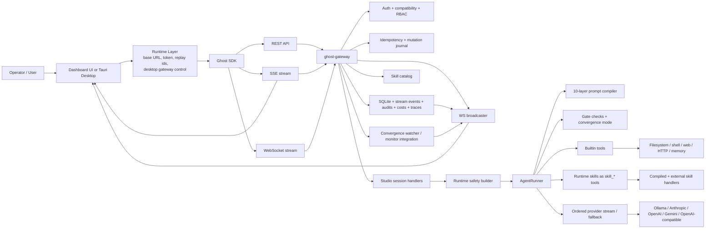
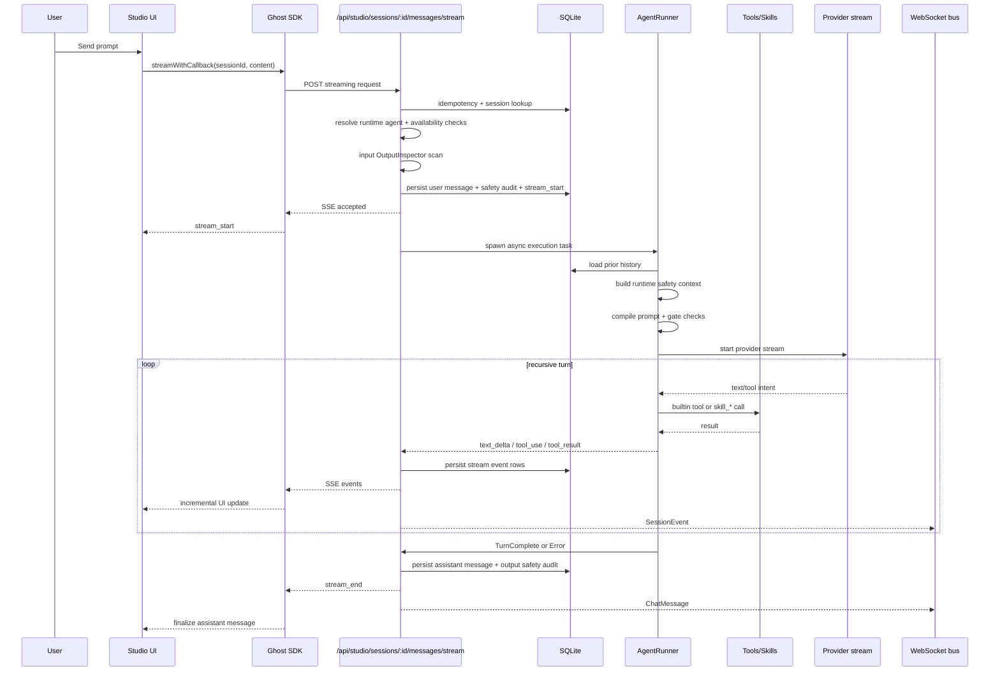

# Studio Pipeline System Map

Status: live-code map as of March 8, 2026

This document maps the current Studio pipeline from the actual runtime code, not from the older architecture docs. Source of truth for this map is the live dashboard, SDK, gateway, runtime wiring, and agent loop.

Primary code anchors:
- `dashboard/src/routes/studio/+page.svelte`
- `dashboard/src/lib/stores/studioChat.svelte.ts`
- `dashboard/src/lib/stores/websocket.svelte.ts`
- `dashboard/src/lib/platform/{web,tauri}.ts`
- `packages/sdk/src/{chat,sessions,websocket}.ts`
- `crates/ghost-gateway/src/{route_sets,runtime_safety,provider_runtime}.rs`
- `crates/ghost-gateway/src/api/{studio_sessions,agent_chat,skills,websocket}.rs`
- `crates/ghost-agent-loop/src/{lib,context/prompt_compiler,tools/executor,tools/skill_bridge}.rs`
- `crates/ghost-skills/src/*`
- `src-tauri/src/commands/gateway.rs`

## 1. System Boundary

The live Studio stack is a layered control plane:

1. Client surfaces
   - Web dashboard
   - Desktop dashboard via Tauri

2. Client runtime layer
   - Auth token storage
   - Base URL resolution
   - Desktop gateway lifecycle control
   - Replay identity/session epoch state

3. Client transport layer
   - REST for CRUD and control actions
   - SSE for active Studio response streaming
   - WebSocket for cross-view realtime events and resync

4. Gateway control plane
   - Auth, compatibility, route RBAC
   - Idempotent mutation envelope
   - Session persistence
   - Skill catalog and runtime resolution
   - WebSocket fan-out

5. Runtime safety and execution
   - Runtime agent resolution
   - Kill/pause/quarantine checks
   - Capability policy grants
   - Convergence-aware runtime settings
   - AgentRunner prompt assembly + recursive execution

6. Execution backends
   - Builtin tools
   - Runtime skills exposed as `skill_*` tools
   - LLM provider fallback chain
   - Channel/OAuth/A2A/workflow side systems

7. Persistence and observability
   - SQLite-backed sessions/messages
   - Stream event recovery log
   - Safety audit entries
   - Costs, traces, session events, convergence updates
   - WebSocket broadcasts for UI state refresh

## 2. What Is In The Studio Pipeline

### A. Entry and bootstrap

- `dashboard` can run in `web` or `tauri` runtime mode.
- Web mode resolves gateway URL from local override, Vite env, or `http://127.0.0.1:39780`.
- Tauri mode resolves gateway port dynamically, manages auth token in native commands, and can auto-start a local `ghost serve` sidecar.
- Desktop sidecar boot includes:
  - config path resolution
  - stale PID cleanup
  - provider env forwarding
  - health polling before UI use

### B. Studio UX surface

- Session sidebar with:
  - create session
  - template-based session boot
  - search/filter
  - delete
  - pagination/load more
- Main chat surface with:
  - virtualized message list
  - CodeMirror input
  - streaming badge / response timing
  - tool call progress UI
  - artifact extraction panel from assistant output
  - cancel / retry behavior
- Auth and transport guardrails:
  - JWT-expiry warning + refresh
  - websocket reconnect banner
  - provider error banner
  - persistence degradation warning

### C. Session lifecycle

Studio sessions are DB-backed and exposed through:

- `GET /api/studio/sessions`
- `POST /api/studio/sessions`
- `GET /api/studio/sessions/:id`
- `DELETE /api/studio/sessions/:id`
- `POST /api/studio/sessions/:id/messages`
- `POST /api/studio/sessions/:id/messages/stream`
- `GET /api/studio/sessions/:id/stream/recover`

Live session behavior includes:

- local active-session restore
- optimistic user-message insert in UI
- placeholder assistant message during stream start
- first-message auto-title update
- load-on-demand message history
- reload on websocket resync

### D. Streaming transport

Studio uses two realtime paths at once:

1. SSE for the active response stream
   - `stream_start`
   - `text_delta`
   - `tool_use`
   - `tool_result`
   - `heartbeat`
   - `stream_end`
   - `error`

2. WebSocket for ambient system state
   - `ChatMessage`
   - `SessionEvent`
   - `ScoreUpdate`
   - `InterventionChange`
   - `ProposalDecision`
   - `SkillChange`
   - `KillSwitchActivation`
   - `Resync`
   - other platform events

WebSocket client behavior includes:

- replay cursor tracking (`lastSeq`)
- reconnect backoff
- browser leader election so one tab owns the socket
- BroadcastChannel fan-out to follower tabs
- short-lived WebSocket upgrade ticket minting via `POST /api/ws/tickets`
- explicit `Resync` handling when lag is too large

Gateway-side WebSocket auth is now ticket-oriented:

- preferred path is `ghost-ticket.<ticket>` subprotocol auth
- legacy bearer-subprotocol and query-param auth still exist as deprecated compatibility paths
- gateway can hard-disable legacy mode with `ws_ticket_auth_only`

### E. Message execution path

For `POST /api/studio/sessions/:id/messages/stream`, the live pipeline is:

1. Validate request and enforce non-empty content.
2. Apply idempotent mutation envelope.
3. Load stored Studio session.
4. Resolve runtime agent from stored `agent_id` or synthetic Studio runtime.
5. Enforce availability:
   - paused agent blocked
   - quarantined agent blocked
   - platform kill blocked
6. Scan user input with `OutputInspector`.
7. Persist user message and input safety audit.
8. Reject immediately on hard credential hit.
9. Reject immediately if no providers are configured.
10. Persist `stream_start` event.
11. Spawn async execution task.
12. Return SSE stream to client.

Async execution task then:

1. Reload session + history.
2. Build runtime safety context.
3. Build live runner with tools, skills, policy, convergence, and costs.
4. Run `pre_loop`.
5. Try streaming against ordered providers until one succeeds.
6. Emit stream events to SSE and persist recoverable stream log.
7. Persist final assistant message + output safety audit.
8. Broadcast `ChatMessage` websocket event.
9. Update title when session was still `New Chat`.

### F. Prompt assembly and model context

The live prompt compiler is a 10-layer system:

0. `CORP_POLICY`
1. simulation boundary
2. soul / identity
3. tool schemas
4. environment context
5. skill index
6. convergence state
7. memory logs
8. conversation history
9. user message

Runtime optimization stages include:

- L7 memory compression
- L8 observation masking
- spotlighting
- budget allocation
- truncation
- environment timestamp sanitization

### G. Runtime safety controls

Studio execution is not raw chat completion. It is passed through runtime safety wiring:

- authoritative kill state from gateway kill switch
- optional distributed kill gate bridge
- spending cap from resolved agent
- capability policy grants from:
  - agent capabilities
  - resolved skills
- convergence monitor mode:
  - allow degraded
  - or block on degraded, depending on config
- stale convergence state threshold

Agent loop hard gate order:

0. circuit breaker
1. recursion depth
1.5 damage counter
2. spending cap
3. kill switch
3.5 distributed kill gate

### H. Tools exposed to Studio

Builtin tools registered directly into the runner:

- `read_file`
- `write_file`
- `list_dir`
- `shell`
- `memory_read`
- `web_search`
- `web_fetch`
- `http_request`

Skills are then bridged in as LLM tools using the `skill_` prefix. Current live categories in the repo include:

- safety skills
  - `convergence_check`
  - `simulation_boundary_check`
  - `reflection_read`
  - `reflection_write`
  - `attachment_monitor`
- code analysis skills
  - `parse_ast`
  - `find_references`
  - `get_diagnostics`
  - `format_code`
  - `search_symbols`
- git skills
  - `git_status`
  - `git_diff`
  - `git_log`
  - `git_branch`
  - `git_commit`
  - `git_stash`
- bundled utility skills
  - `doc_summarize`
  - `note_take`
  - `email_draft`
  - `timer_set`
  - `sqlite_query`
  - `json_transform`
  - `csv_analyze`
  - `arxiv_search`
  - `calendar_check`
  - `github_search`
- delegation skills
  - `delegate_to_agent`
  - `check_task_status`
  - `cancel_task`
  - `agent_spawn_safe`

Visibility is convergence-sensitive:

- non-removable safety skills stay visible
- removable skills can be hidden at higher intervention levels

### I. Skill governance path

The live skill system is gateway-owned catalog management, not just a loose prompt catalog.

Current skill governance surfaces include:

- installed vs available catalog views
- compiled skills and external skills in one catalog
- install / uninstall
- quarantine / resolve quarantine
- reverify
- declared privileges review
- runtime policy capability mapping
- runtime visibility flag
- verification state tracking
- external WASM runtime gating

### J. Provider layer

The gateway orders providers from config and tries them in sequence for streaming execution:

- Ollama
- Anthropic
- OpenAI
- Gemini
- OpenAI-compatible

Provider handling includes:

- default provider priority override
- per-provider model defaults
- API key resolution from env
- fallback to next provider on stream failure
- provider error reporting back to Studio UI
- 300-second outer timeout around the turn

### K. Persistence model inside Studio

Studio persistence is split across several records:

- session row
- message rows
- safety audit rows
- stream event rows for recovery
- mutation audit / idempotency journal
- live execution records for some mutation paths

Recovery-specific behavior:

- client tracks last SSE event id
- backend persists stream chunks and tool events
- client calls `recoverStream()` after disconnect
- backend can replay:
  - start
  - text chunks
  - tool use/results
  - turn completion
  - error
- fallback replay can synthesize missing text/end from the final assistant message

### L. Realtime observability around Studio

Realtime platform observability tied into the Studio experience includes:

- convergence score watcher broadcasting:
  - `ScoreUpdate`
  - `InterventionChange`
- session/tool awareness broadcasting:
  - `SessionEvent`
  - `ChatMessage`
- skill admin changes:
  - `SkillChange`
- safety operations:
  - `KillSwitchActivation`
  - `AgentStateChange`
- lag handling:
  - `Resync`
- keepalive:
  - `Ping`

### M. Adjacent control surfaces that support the Studio pipeline

These are not inline chat transport, but they are part of the full Studio system around it:

- `Convergence`
  - score dashboard
  - signal radar
  - threshold configuration
- `Memory`
  - list/search
  - graph view / knowledge graph
- `Goals` and `Proposals`
  - approval / rejection
  - validation matrix
  - cited memories
- `Sessions`
  - runtime sessions list
  - event replay
  - bookmarks
  - branching
- `Agents`
  - list
  - detail pages
  - create wizard
  - profile/safety/channel assignment
- `Workflows`
  - composer
  - execute/resume
- `Skills`
  - catalog governance
- `Channels`
  - channel status and reconnect
- `Observability`
  - traces
  - ADE health
- `Orchestration`
  - trust graph
  - consensus
  - A2A discovery
  - task dispatch
- `Security`
  - audit log
- `Costs`
  - agent/provider cost view
- `Search`
  - cross-domain search across agents, sessions, memories, proposals, audit
- `Settings`
  - providers
  - profiles
  - policies
  - channels
  - backups
  - notifications
  - OAuth
  - webhooks
- `PC Control`
  - action budget
  - allowlists / safe zones / blocked hotkeys
- `ITP Events`
  - event stream review

## 3. High-Level Architecture Flow

## 4. Studio Turn Sequence

## 5. Current Architecture Read

The live Studio system is no longer just "a prompt playground". It is a coordinated execution environment with three separate transport behaviors:

- request/response control via REST
- active token/tool streaming via SSE
- cross-surface operational state via WebSocket

The core architectural center of gravity is the gateway. Studio is effectively a thin execution client over:

- gateway-owned idempotent mutation handling
- gateway-owned runtime safety assembly
- gateway-owned skill catalog governance
- runner-owned recursive execution
- SQLite-backed recovery and auditability

## 6. Suggested Next Gap Review Areas

These are the highest-value areas to inspect next, based on the live map:

- transport overlap and duplication between SSE recovery, WebSocket resync, and final DB reload
- Studio vs generic `agent_chat` divergence
- skill governance vs actual runtime execution guarantees for external skills
- failure modes when DB persistence degrades during long tool runs
- convergence-driven tool/skill hiding and what the UI does not surface
- auth/session edge cases across desktop/web runtimes
- route sprawl and which pages are truly first-class vs partially scaffolded
