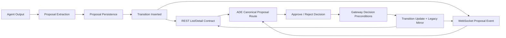

# Proposal Architecture And Contract Model

Date: March 11, 2026

Status: Target architecture

Purpose: define the canonical proposal domain model and cross-layer contract rules the implementation must follow.

## Authority Model

### Storage authority

Canonical lifecycle truth comes from:

- `goal_proposal_transitions`
- latest `to_state` per proposal
- lineage head state where supersession matters

Legacy projection exists only for compatibility and audit convenience:

- `goal_proposals.decision`
- `goal_proposals.resolved_at`
- `goal_proposals.resolver`

Rule:

- reads derive status from transitions
- writes update transitions first-class and legacy projection as a derived mirror

### API authority

REST responses must publish an explicit canonical status field.

Required response concept:

```text
proposal.status = one of:
pending_review | approved | rejected | superseded | timed_out | auto_applied | auto_rejected
```

`current_state` may remain during migration, but the public contract must converge to one explicit field name.

### UI authority

ADE must never infer pending/historical class from:

- `decision === null`
- `resolved_at === null`
- string heuristics over legacy decision values

ADE must consume the canonical API status field directly.

## Canonical Flow



## Canonical Route Model

The implementation must choose one canonical route:

- recommended: `/goals`

Reason:

- already closer to server-authoritative mutation flow
- already has a detail route
- conceptually matches the API namespace

Required route structure:

1. List route
   - pending/history tabs
   - filter controls
   - queue counts
   - live updates
2. Detail route
   - full content
   - transition history
   - lineage/review preconditions
   - approve/reject actions

If `/approvals` remains temporarily:

- it must redirect to the canonical route, or
- reuse the same stores/components with no divergent behavior

## Canonical REST Contract

### List

`GET /api/goals`

Required semantics:

- `status=pending` maps to canonical `pending_review`
- `status=approved` maps to canonical `approved`
- `status=rejected` maps to canonical `rejected`
- `status=history` may be added for all terminal states
- terminal states are explicit and deterministic

Required payload concepts:

- `status`
- `created_at`
- `resolved_at`
- `agent_id`
- `operation`
- `target_type`
- minimal summary metadata for queue rendering

### Detail

`GET /api/goals/{id}`

Required semantics:

- includes canonical status
- includes transition history
- includes current review preconditions:
  - lineage id
  - subject key
  - reviewed revision
- includes stale-review-relevant state

### Decision mutation

`POST /api/goals/{id}/approve`

`POST /api/goals/{id}/reject`

Required semantics:

- decisions are valid only against current canonical state
- stale conflicts are explicit and typed
- response shape is stable enough for UI refresh logic

## Canonical WebSocket Contract

The current `ProposalDecision` event is insufficient.

Target event model:

### Option A: explicit events

- `ProposalCreated`
- `ProposalStateChanged`

### Option B: single canonical event

- `ProposalUpdated`
  - includes `proposal_id`
  - includes `status`
  - includes enough summary data to update queues

Required rule:

- the operator queue must become correct from WebSocket plus initial REST load
- `Resync` remains a repair path, not the primary proposal update mechanism

## Service Worker Contract Decision

One of these must be chosen explicitly:

### Option 1. Proposal decisions are not offline-queueable

Use when strict operator correctness is preferred over offline convenience.

Benefits:

- simpler safety model
- no ambiguous deferred approval semantics

### Option 2. Proposal decisions are offline-queueable

Allowed only if:

- stale replay is surfaced to user
- superseded replay is handled explicitly
- queued actions are invalidated on auth/session rotation
- dedicated proposal replay tests exist

Recommendation:

- remove proposal decision offline queueing unless a hard product requirement demands it

## Shared Component Model

The final UI should have:

- one shared proposal list component
- one shared proposal detail component
- one shared decision action controller
- one shared proposal store or route-level data authority

It should not have:

- separate `/goals` and `/approvals` components that reimplement filtering, detail loading, or decision flows differently

## Invariants

These must always hold:

1. If status is `pending_review`, the proposal is actionable by a human.
2. If status is terminal, it is not shown in pending.
3. If a newer proposal supersedes an older one, the older one cannot still appear actionable.
4. If a decision succeeds, the UI eventually reflects server truth even if WebSocket delivery is delayed.
5. If a decision is stale, the operator is told why and shown refreshed truth.
